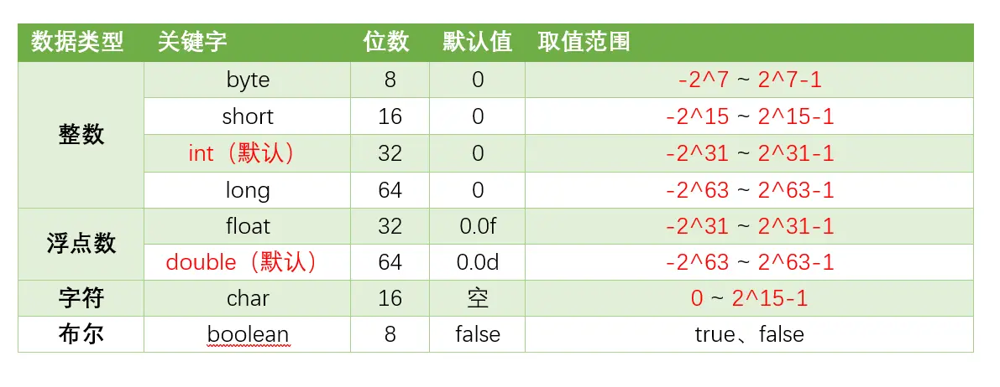

# 1. Java基础面试题

## 1.1 概念

### Java特点
- **平台无关性**：Java的“编写一次，运行无处不在”哲学是其最大的特点之一。Java编译器将源代码编译成字节码（bytecode），该字节码可以在任何安装了Java虚拟机（JVM）的系统上运行。
- **面向对象**：Java是一门严格的面向对象编程语言，几乎一切都是对象。面向对象编程（OOP）特性使得代码更易于维护和重用，包括类（class）、对象（object）、继承（inheritance）、多态（polymorphism）、抽象（abstraction）和封装（encapsulation）。
- **内存管理**：Java有自己的垃圾回收机制，自动管理内存和回收不再使用的对象。这样，开发者不需要手动管理内存，从而减少内存泄漏和其他内存相关的问题。

### Java为什么是跨平台的？
Java能支持跨平台，主要依赖于JVM。  
JVM是一个软件，不同的平台有不同的版本。我们编写的Java源码，编译后会生成一种 `.class` 文件，称为字节码文件。Java虚拟机就是负责将字节码文件翻译成特定平台下的机器码然后运行。也就是说，只要在不同平台上安装对应的JVM，就可以运行字节码文件，运行我们编写的Java程序。

而这个过程中，我们编写的Java程序没有做任何改变，仅仅是通过JVM这一“中间层”，就能在不同平台上运行，真正实现了“**一次编译，到处运行**”的目的。  

JVM是一个“桥梁”，是一个“中间件”，是实现跨平台的关键，Java代码首先被编译成字节码文件，再由JVM将字节码文件翻译成机器码，从而达到运行Java程序的目的。

编译的结果不是生成机器码，而是生成字节码，字节码不能直接运行，必须通过JVM翻译成机器码才能运行。不同平台下编译生成的字节码是一样的，但是由JVM翻译成的机器码却不一样。

所以，运行Java程序必须有JVM的支持，因为编译的结果不是机器码，必须要经过JVM的再次翻译才能执行。即使你将Java程序打包成可执行文件（例如 `.exe`），仍然需要JVM的支持。

跨平台的是Java程序，不是JVM。JVM是用C/C++开发的，是编译后的机器码，不能跨平台，不同平台下需要安装不同版本的JVM。

### JVM、JDK、JRE三者关系

它们之间的关系如下：
- **JVM** 是Java虚拟机，是Java程序运行的环境。它负责将Java字节码（由Java编译器生成）解释或编译成机器码，并执行程序。JVM提供了内存管理、垃圾回收、安全性等功能，使得Java程序具备跨平台性。
- **JDK** 是Java开发工具包，是开发Java程序所需的工具集合。它包含了JVM、编译器（`javac`）、调试器（`jdb`）等开发工具，以及一系列的类库（如Java标准库和开发工具库）。JDK提供了开发、编译、调试和运行Java程序所需的全部工具和环境。
- **JRE** 是Java运行时环境，是Java程序运行所需的最小环境。它包含了JVM和一组Java类库，用于支持Java程序的执行。JRE不包含开发工具，只提供Java程序运行所需的运行环境。

### 为什么Java解释和编译都有？
首先在Java经过编译之后生成字节码文件，接下来进入JVM中，就有两个步骤：编译和解释，如下图：

- **编译性**：Java源代码首先被编译成字节码，JIT会把编译过的机器码保存起来，以备下次使用。
- **解释性**：JVM中有一个方法调用计数器，当累计计数大于一定值的时候，就使用JIT进行编译生成机器码文件。否则就是用解释器进行解释执行，然后字节码也是经过解释器进行解释运行的。

所以Java既是编译型语言也是解释性语言，默认采用的是解释器和编译器混合的模式。

### jvm是什么
JVM是Java虚拟机，主要工作是解释自己的指令集（即字节码）并映射到本地的CPU指令集和OS的系统调用。  

JVM屏蔽了与操作系统平台相关的信息，使得Java程序只需要生成在Java虚拟机上运行的目标代码（字节码），就可在多种平台上不加修改地运行，这也是Java能够“**一次编译，到处运行**”的原因。

### 编译型语言和解释型语言的区别
编译型语言和解释型语言的区别在于：
- **编译型语言**：在程序执行之前，整个源代码会被编译成机器码或者字节码，生成可执行文件。执行时直接运行编译后的代码，速度快，但跨平台性较差。
- **解释型语言**：在程序执行时，逐行解释执行源代码，不生成独立的可执行文件。通常由解释器动态解释并执行代码，跨平台性好，但执行速度相对较慢。

典型的编译型语言如C、C++，典型的解释型语言如Python、JavaScript。

### Python和Java区别是什么？
- **Java** 是一种已编译的编程语言，Java编译器将源代码编译为字节码，而字节码则由Java虚拟机执行。
- **Python** 是一种解释语言，翻译时会在执行程序的同时进行翻译。

## 1.2 数据类型

### 八种基本的数据类型

Java支持数据类型分为两类： 基本数据类型和引用数据类型。

基本数据类型共有8种，可以分为三类：

数值型：整数类型（byte、short、int、long）和浮点类型（float、double）
字符型：char
布尔型：boolean

8种基本数据类型的默认值、位数、取值范围，如下表所示：

Float和Double的最小值和最大值都是以科学记数法的形式输出的，结尾的“E+数字”表示E之前的数字要乘以10的多少倍。比如3.14E3就是3.14×1000=3140，3.14E-3就是3.14/1000=0.00314。

注意一下几点：

java八种基本数据类型的字节数:1字节(byte、boolean)、 2字节(short、char)、4字节(int、float)、8字节(long、double)
浮点数的默认类型为double（如果需要声明一个常量为float型，则必须要在末尾加上f或F）
整数的默认类型为int（声明Long型在末尾加上l或者L）
八种基本数据类型的包装类：除了char的是Character、int类型的是Integer，其他都是首字母大写
char类型是无符号的，不能为负，所以是0开始的

### long和int可以互转吗 ？

可以的，Java中的long和int可以相互转换。由于long类型的范围比int类型大，因此将int转换为long是安全的，而将long转换为int可能会导致数据丢失或溢出。

将int转换为long可以通过直接赋值或强制类型转换来实现。例如：

将long转换为int需要使用强制类型转换，但需要注意潜在的数据丢失或溢出问题。

在将long转换为int时，如果longValue的值超出了int类型的范围，转换结果将是截断后的低位部分。因此，在进行转换之前，建议先检查longValue的值是否在int类型的范围内，以避免数据丢失或溢出的问题。

### 数据类型转换方式你知道哪些？

自动类型转换（隐式转换）：当目标类型的范围大于源类型时，Java会自动将源类型转换为目标类型，不需要显式的类型转换。例如，将int转换为long、将float转换为double等。
强制类型转换（显式转换）：当目标类型的范围小于源类型时，需要使用强制类型转换将源类型转换为目标类型。这可能导致数据丢失或溢出。例如，将long转换为int、将double转换为int等。语法为：目标类型 变量名 = (目标类型) 源类型。
字符串转换：Java提供了将字符串表示的数据转换为其他类型数据的方法。例如，将字符串转换为整型int，可以使用Integer.parseInt()方法；将字符串转换为浮点型double，可以使用Double.parseDouble()方法等。
数值之间的转换：Java提供了一些数值类型之间的转换方法，如将整型转换为字符型、将字符型转换为整型等。这些转换方式可以通过类型的包装类来实现，例如Character类、Integer类等提供了相应的转换方法。