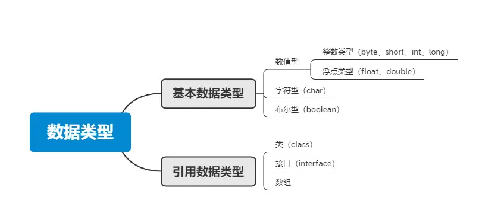
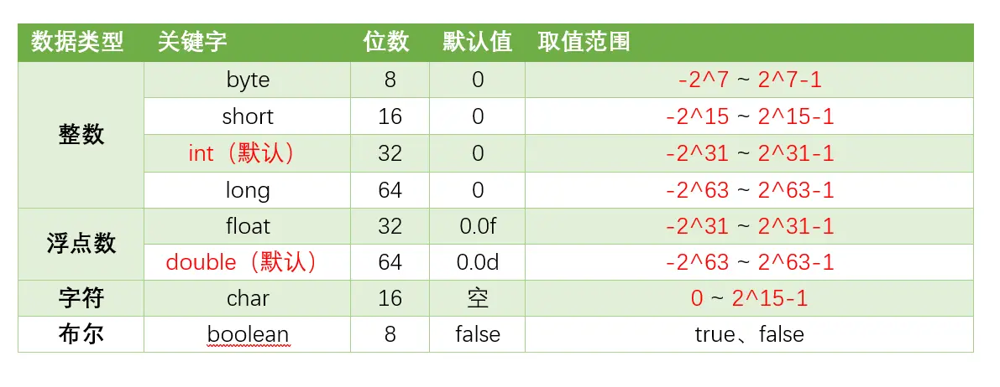

# 1. Java基础面试题

## 1.1 概念

### Java特点
- **平台无关性**：Java的“编写一次，运行无处不在”哲学是其最大的特点之一。Java编译器将源代码编译成字节码（bytecode），该字节码可以在任何安装了Java虚拟机（JVM）的系统上运行。
- **面向对象**：Java是一门严格的面向对象编程语言，几乎一切都是对象。面向对象编程（OOP）特性使得代码更易于维护和重用，包括类（class）、对象（object）、继承（inheritance）、多态（polymorphism）、抽象（abstraction）和封装（encapsulation）。
- **内存管理**：Java有自己的垃圾回收机制，自动管理内存和回收不再使用的对象。这样，开发者不需要手动管理内存，从而减少内存泄漏和其他内存相关的问题。

### Java为什么是跨平台的？
Java能支持跨平台，主要依赖于JVM。  
JVM是一个软件，不同的平台有不同的版本。我们编写的Java源码，编译后会生成一种 `.class` 文件，称为字节码文件。Java虚拟机就是负责将字节码文件翻译成特定平台下的机器码然后运行。也就是说，只要在不同平台上安装对应的JVM，就可以运行字节码文件，运行我们编写的Java程序。

而这个过程中，我们编写的Java程序没有做任何改变，仅仅是通过JVM这一“中间层”，就能在不同平台上运行，真正实现了“**一次编译，到处运行**”的目的。  

JVM是一个“桥梁”，是一个“中间件”，是实现跨平台的关键，Java代码首先被编译成字节码文件，再由JVM将字节码文件翻译成机器码，从而达到运行Java程序的目的。

编译的结果不是生成机器码，而是生成字节码，字节码不能直接运行，必须通过JVM翻译成机器码才能运行。不同平台下编译生成的字节码是一样的，但是由JVM翻译成的机器码却不一样。

所以，运行Java程序必须有JVM的支持，因为编译的结果不是机器码，必须要经过JVM的再次翻译才能执行。即使你将Java程序打包成可执行文件（例如 `.exe`），仍然需要JVM的支持。

跨平台的是Java程序，不是JVM。JVM是用C/C++开发的，是编译后的机器码，不能跨平台，不同平台下需要安装不同版本的JVM。

### JVM、JDK、JRE三者关系

它们之间的关系如下：
- **JVM** 是Java虚拟机，是Java程序运行的环境。它负责将Java字节码（由Java编译器生成）解释或编译成机器码，并执行程序。JVM提供了内存管理、垃圾回收、安全性等功能，使得Java程序具备跨平台性。
- **JDK** 是Java开发工具包，是开发Java程序所需的工具集合。它包含了JVM、编译器（`javac`）、调试器（`jdb`）等开发工具，以及一系列的类库（如Java标准库和开发工具库）。JDK提供了开发、编译、调试和运行Java程序所需的全部工具和环境。
- **JRE** 是Java运行时环境，是Java程序运行所需的最小环境。它包含了JVM和一组Java类库，用于支持Java程序的执行。JRE不包含开发工具，只提供Java程序运行所需的运行环境。

### 为什么Java解释和编译都有？
首先在Java经过编译之后生成字节码文件，接下来进入JVM中，就有两个步骤：编译和解释，如下图：

- **编译性**：Java源代码首先被编译成字节码，JIT会把编译过的机器码保存起来，以备下次使用。
- **解释性**：JVM中有一个方法调用计数器，当累计计数大于一定值的时候，就使用JIT进行编译生成机器码文件。否则就是用解释器进行解释执行，然后字节码也是经过解释器进行解释运行的。

所以Java既是编译型语言也是解释性语言，默认采用的是解释器和编译器混合的模式。

### jvm是什么
JVM是Java虚拟机，主要工作是解释自己的指令集（即字节码）并映射到本地的CPU指令集和OS的系统调用。  

JVM屏蔽了与操作系统平台相关的信息，使得Java程序只需要生成在Java虚拟机上运行的目标代码（字节码），就可在多种平台上不加修改地运行，这也是Java能够“**一次编译，到处运行**”的原因。

### 编译型语言和解释型语言的区别
编译型语言和解释型语言的区别在于：
- **编译型语言**：在程序执行之前，整个源代码会被编译成机器码或者字节码，生成可执行文件。执行时直接运行编译后的代码，速度快，但跨平台性较差。
- **解释型语言**：在程序执行时，逐行解释执行源代码，不生成独立的可执行文件。通常由解释器动态解释并执行代码，跨平台性好，但执行速度相对较慢。

典型的编译型语言如C、C++，典型的解释型语言如Python、JavaScript。

### Python和Java区别是什么？
- **Java** 是一种已编译的编程语言，Java编译器将源代码编译为字节码，而字节码则由Java虚拟机执行。
- **Python** 是一种解释语言，翻译时会在执行程序的同时进行翻译。

## 1.2 数据类型

### 八种基本的数据类型

Java支持数据类型分为两类：基本数据类型和引用数据类型。

基本数据类型共有8种，可以分为三类：

- 数值型：整数类型（`byte`、`short`、`int`、`long`）和浮点类型（`float`、`double`）
- 字符型：`char`
- 布尔型：`boolean`

8种基本数据类型的默认值、位数、取值范围，如下表所示：

> **说明：**
> - `Float` 和 `Double` 的最小值和最大值都是以科学记数法的形式输出的，结尾的 “E+数字” 表示 E 之前的数字要乘以 10 的多少倍。比如 `3.14E3` 就是 `3.14 × 1000 = 3140`，`3.14E-3` 就是 `3.14 / 1000 = 0.00314`。
> - Java八种基本数据类型的字节数：
>     - 1 字节：`byte`、`boolean`
>     - 2 字节：`short`、`char`
>     - 4 字节：`int`、`float`
>     - 8 字节：`long`、`double`
> - 浮点数的默认类型为 `double`（如果需要声明一个常量为 `float` 型，则必须要在末尾加上 `f` 或 `F`）。
> - 整数的默认类型为 `int`（声明 `Long` 型在末尾加上 `l` 或 `L`）。
> - 八种基本数据类型的包装类：除了 `char` 对应的是 `Character`，`int` 类型的是 `Integer`，其他都是首字母大写。
> - `char` 类型是无符号的，不能为负，所以是从 0 开始的。

---

### `long` 和 `int` 可以互转吗？

可以的，Java中的 `long` 和 `int` 可以相互转换。由于 `long` 类型的范围比 `int` 类型大，因此将 `int` 转换为 `long` 是安全的，而将 `long` 转换为 `int` 可能会导致数据丢失或溢出。

- 将 `int` 转换为 `long` 可以通过直接赋值或强制类型转换来实现。
- 将 `long` 转换为 `int` 需要使用强制类型转换，但需要注意潜在的数据丢失或溢出问题。

> 在将 `long` 转换为 `int` 时，如果 `longValue` 的值超出了 `int` 类型的范围，转换结果将是截断后的低位部分。因此，在进行转换之前，建议先检查 `longValue` 的值是否在 `int` 类型的范围内，以避免数据丢失或溢出的问题。

---

### 数据类型转换方式你知道哪些？

- **自动类型转换（隐式转换）**：当目标类型的范围大于源类型时，Java 会自动将源类型转换为目标类型，不需要显式的类型转换。例如，将 `int` 转换为 `long`、将 `float` 转换为 `double` 等。

- **强制类型转换（显式转换）**：当目标类型的范围小于源类型时，需要使用强制类型转换将源类型转换为目标类型。这可能导致数据丢失或溢出。例如，将 `long` 转换为 `int`、将 `double` 转换为 `int` 等。语法为：`目标类型 变量名 = (目标类型) 源类型`。

- **字符串转换**：Java 提供了将字符串表示的数据转换为其他类型数据的方法。例如，将字符串转换为整型 `int`，可以使用 `Integer.parseInt()` 方法；将字符串转换为浮点型 `double`，可以使用 `Double.parseDouble()` 方法等。

- **数值之间的转换**：Java 提供了一些数值类型之间的转换方法，如将整型转换为字符型、将字符型转换为整型等。这些转换方式可以通过类型的包装类来实现，例如 `Character` 类、`Integer` 类等提供了相应的转换方法。

### 类型互转会出现什么问题吗？

- **数据丢失**：当将一个范围较大的数据类型转换为一个范围较小的数据类型时，可能会发生数据丢失。例如，将一个 `long` 类型的值转换为 `int` 类型时，如果 `long` 值超出了 `int` 类型的范围，转换结果将是截断后的低位部分，高位部分的数据将丢失。
- **数据溢出**：与数据丢失相反，当将一个范围较小的数据类型转换为一个范围较大的数据类型时，可能会发生数据溢出。例如，将一个 `int` 类型的值转换为 `long` 类型时，转换结果会填充额外的高位空间，但原始数据仍然保持不变。
- **精度损失**：在进行浮点数类型的转换时，可能会发生精度损失。由于浮点数的表示方式不同，将一个单精度浮点数 (`float`) 转换为双精度浮点数 (`double`) 时，精度可能会损失。
- **类型不匹配导致的错误**：在进行类型转换时，需要确保源类型和目标类型是兼容的。如果两者不兼容，会导致编译错误或运行时错误。

### 为什么用 `BigDecimal` 不用 `double`？

`double` 会出现精度丢失的问题，`double` 执行的是二进制浮点运算，二进制有些情况下不能准确地表示一个小数，就像十进制不能准确地表示 `1/3`（`1/3 = 0.3333...`），也就是说，二进制表示小数时只能够表示能够用 `1/(2^n)` 的和的任意组合，但是 `0.1` 不能够精确表示，因为它不能够表示成为 `1/(2^n)` 的和的形式。

在 Java 中进行浮点数运算时，会出现丢失精度的问题。那么我们如果在进行商品价格计算的时候，就会出现问题。很有可能造成我们手中有 `0.06` 元，却无法购买一个 `0.05` 元和一个 `0.01` 元的商品。因为如上所示，它们两个的总和为 `0.060000000000000005`。这无疑是一个很严重的问题，尤其是当电商网站的并发量上去的时候，出现的问题将是巨大的，可能会导致无法下单，或者对账出现问题。

而 `BigDecimal` 是精确计算的，因此一般牵涉到金钱的计算时，都使用 `BigDecimal`。

我们创建了两个 `BigDecimal` 对象 `num1` 和 `num2`，分别表示 `0.1` 和 `0.2` 这两个十进制数。然后，我们使用 `add()` 方法计算它们的和，并使用 `multiply()` 方法计算它们的乘积。最后，我们通过 `System.out.println()` 打印结果。

这样的使用 `BigDecimal` 可以确保精确的十进制数值计算，避免了使用 `double` 可能出现的舍入误差。需要注意的是，在创建 `BigDecimal` 对象时，应该使用字符串作为参数，而不是直接使用浮点数值，以避免浮点数精度丢失。

### 装箱和拆箱是什么？

装箱（Boxing）和拆箱（Unboxing）是将基本数据类型和对应的包装类之间进行转换的过程。

~~~java
Integer i = 10;  //装箱
int n = i;   //拆箱
~~~

自动装箱主要发生在两种情况，一种是赋值时，另一种是在方法调用的时候。

**赋值时**  
这是最常见的一种情况，在 Java 1.5 以前我们需要手动地进行转换才行，而现在所有的转换都是由编译器来完成。

~~~java
//before autoboxing
Integer iObject = Integer.valueOf(3);
int iPrimitive = iObject.intValue();

//after java5
Integer iObject = 3; //autoboxing - primitive to wrapper conversion
int iPrimitive = iObject; //unboxing - object to primitive conversion
~~~

**方法调用时**  
当我们在方法调用时，我们可以传入原始数据值或者对象，同样编译器会帮我们进行转换。

~~~java
public static Integer show(Integer iParam){
   System.out.println("autoboxing example - method invocation i: " + iParam);
   return iParam;
}
~~~

**自动装箱和拆箱示例**

~~~java
//autoboxing and unboxing in method invocation
show(3); //autoboxing
int result = show(3); //unboxing because return type of method is Integer
~~~

`show` 方法接受 `Integer` 对象作为参数，当调用 `show(3)` 时，会将 `int` 值转换成对应的 `Integer` 对象，这就是所谓的自动装箱，`show` 方法返回 `Integer` 对象，而 `int result = show(3);` 中 `result` 为 `int` 类型，所以这时候发生自动拆箱操作，将 `show` 方法返回的 `Integer` 对象转换成 `int` 值。

**自动装箱的弊端**  
自动装箱有一个问题，那就是在一个循环中进行自动装箱操作的情况，如下面的例子就会创建多余的对象，影响程序的性能。

~~~java
Integer sum = 0; 
for(int i=1000; i<5000; i++){   
    sum+=i; 
} 
~~~

上面的代码 `sum+=i` 可以看成 `sum = sum + i`，但是 `+` 这个操作符不适用于 `Integer` 对象，首先 `sum` 进行自动拆箱操作，进行数值相加操作，最后发生自动装箱操作转换成 `Integer` 对象。其内部变化如下：

~~~java
int result = sum.intValue() + i; 
Integer sum = new Integer(result);
~~~

由于我们这里声明的 `sum` 为 `Integer` 类型，在上面的循环中会创建将近 4000 个无用的 `Integer` 对象，在这样庞大的循环中，会降低程序的性能并且加重了垃圾回收的工作量。因此在我们编程时，需要注意到这一点，正确地声明变量类型，避免因为自动装箱引起的性能问题。

#### Java为什么要有Integer？

`Integer` 是 `int` 类型的包装类，它将 `int` 类型包装成 `Object` 对象。对象封装有很多好处，可以把属性（数据）和处理这些数据的方法结合在一起。例如，`Integer` 就有 `parseInt()` 等方法来专门处理 `int` 类型相关的数据。

另一个非常重要的原因是，在 Java 中，绝大部分方法或类都是用来处理类类型对象的。如 `ArrayList` 集合类只能存储对象类型的元素，如果想把一个 `int` 型的数据存入 `list` 中，就必须将它包装成 `Integer` 类。因此，`Integer` 的存在是非常必要的。

**泛型中的应用**  
在 Java 中，泛型只能使用引用类型，不能使用基本类型。因此，如果要在泛型中使用 `int` 类型，必须使用 `Integer` 包装类。例如，假设我们有一个列表，想要将其元素排序，并将排序结果存储在一个新的列表中。如果我们使用基本数据类型 `int`，无法直接使用 `Collections.sort()` 方法。但如果我们使用 `Integer` 包装类，则可以轻松地使用该方法。

~~~java
List<Integer> list = new ArrayList<>();
list.add(3);
list.add(1);
list.add(2);
Collections.sort(list);
System.out.println(list);
~~~

**转换中的应用**  
在 Java 中，基本类型和引用类型不能直接进行转换，必须使用包装类来实现。例如，将一个 `int` 类型的值转换为 `String` 类型，必须首先将其转换为 `Integer` 类型，再转换为 `String` 类型。

~~~java
int i = 10;
Integer integer = new Integer(i);
String str = integer.toString();
System.out.println(str);
~~~

**集合中的应用**  
Java 集合只能存储对象，而不能存储基本数据类型。因此，如果要将 `int` 类型的数据存储在集合中，必须使用 `Integer` 包装类。例如，假设我们有一个列表，想要计算列表中所有元素的和。如果我们使用基本数据类型 `int`，需要使用循环遍历列表并将每个元素相加。但如果我们使用 `Integer` 包装类，则可以直接使用 `stream()` 方法来计算和。

~~~java
List<Integer> list = new ArrayList<>();
list.add(3);
list.add(1);
list.add(2);
int sum = list.stream().mapToInt(Integer::intValue).sum();
System.out.println(sum);
~~~

#### Integer相比int有什么优点？

`int` 是 Java 中的原始数据类型，而 `Integer` 是 `int` 的包装类。

**`Integer` 和 `int` 的区别：**

- **基本类型和引用类型**：`int` 是基本数据类型，`Integer` 是引用类型。基本数据类型是 Java 中最基本的数据类型，不需要实例化就能使用。而引用类型则需要通过实例化对象来使用。这意味着，使用 `int` 存储一个整数时，不需要额外的内存分配，而使用 `Integer` 时，必须为对象分配内存。在性能方面，基本数据类型的操作通常比对应的引用类型快。
  
- **自动装箱和拆箱**：`Integer` 作为 `int` 的包装类，可以实现自动装箱和拆箱。自动装箱是指将基本类型转化为相应的包装类类型，自动拆箱则是将包装类类型转化为基本类型。这使得 Java 程序员更加方便地进行数据类型转换。例如，当需要将 `int` 类型的值赋给 `Integer` 变量时，Java 会自动将 `int` 类型转换为 `Integer` 类型；同样地，当将 `Integer` 类型的值赋给 `int` 变量时，Java 会自动将 `Integer` 类型转换为 `int` 类型。

- **空指针异常**：`int` 变量可以直接赋值为 0，而 `Integer` 变量必须通过实例化对象来赋值。如果对一个未经初始化的 `Integer` 变量进行操作，会抛出空指针异常。这是因为它被赋予了 `null` 值，而 `null` 无法进行自动拆箱。

#### 那为什么还要保留int类型？

包装类是引用类型，对象的引用和对象本身是分开存储的。而基本类型数据，变量对应的内存块直接存储数据本身。因此，基本类型数据在读写效率方面，比包装类高效。除此之外，在 64 位 JVM 上，在开启引用压缩的情况下，一个 `Integer` 对象占用 16 个字节的内存空间，而一个 `int` 类型数据只占用 4 字节的内存空间，前者对空间的占用是后者的 4 倍。

也就是说，无论是读写效率，还是存储效率，基本类型都比包装类高效。

#### 说一下 Integer 的缓存

Java 的 `Integer` 类内部实现了一个静态缓存池，用于存储特定范围内的整数值对应的 `Integer` 对象。

默认情况下，这个范围是 -128 至 127。当通过 `Integer.valueOf(int)` 方法创建一个在这个范围内的整数对象时，并不会每次都生成新的对象实例，而是复用缓存中的现有对象，会直接从内存中取出，而不需要新建一个对象。

## 1.3 面向对象

### 怎么理解面向对象？简单说说封装继承多态

面向对象是一种编程范式，它将现实世界中的事物抽象为对象，对象具有属性（字段）和行为（方法）。面向对象编程的设计思想是以对象为中心，通过对象之间的交互来完成程序的功能，具有灵活性和可扩展性，通过封装和继承可以更好地应对需求变化。

Java面向对象的三大特性包括：封装、继承、多态。

- **封装**：封装是指将对象的属性（数据）和行为（方法）结合在一起，对外隐藏对象的内部细节，仅通过对象提供的接口与外界交互。封装的目的是增强安全性和简化编程，使得对象更加独立。
- **继承**：继承是一种可以使得子类自动共享父类数据结构和方法的机制。它是代码复用的重要手段，通过继承可以建立类与类之间的层次关系，使得结构更加清晰。
- **多态**：多态是指允许不同类的对象对同一消息作出响应。即同一个接口，使用不同的实例而执行不同操作。多态性可以分为编译时多态（重载）和运行时多态（重写）。它使得程序具有良好的灵活性和扩展性。

### 多态体现在哪几个方面？

多态在面向对象编程中可以体现在以下几个方面：

- **方法重载**：方法重载是指同一类中可以有多个同名方法，它们具有不同的参数列表（参数类型、数量或顺序不同）。虽然方法名相同，但根据传入的参数不同，编译器会在编译时确定调用哪个方法。  
示例：对于一个 add 方法，可以定义为 add(int a, int b) 和 add(double a, double b)。
- **方法重写**：方法重写是指子类能够提供对父类中同名方法的具体实现。在运行时，JVM会根据对象的实际类型确定调用哪个版本的方法。这是实现多态的主要方式。  
示例：在一个动物类中，定义一个 sound 方法，子类 Dog 可以重写该方法以实现 bark，而 Cat 可以实现 meow。
- **接口与实现**：多态也体现在接口的使用上，多个类可以实现同一个接口，并且用接口类型的引用来调用这些类的方法。这使得程序在面对不同具体实现时保持一贯的调用方式。  
示例：多个类（如 Dog, Cat）都实现了一个 Animal 接口，当用 Animal 类型的引用来调用 makeSound 方法时，会触发对应的实现。
- **向上转型和向下转型**：在Java中，可以使用父类类型的引用指向子类对象，这是向上转型。通过这种方式，可以在运行时期采用不同的子类实现。向下转型是将父类引用转回其子类类型，但在执行前需要确认引用实际指向的对象类型以避免 ClassCastException。

### 多态解决了什么问题？

多态是指子类可以替换父类，在实际的代码运行过程中，调用子类的方法实现。多态这种特性也需要编程语言提供特殊的语法机制来实现，比如继承、接口类。

多态可以提高代码的扩展性和复用性，是很多设计模式、设计原则、编程技巧的代码实现基础。比如策略模式、基于接口而非实现编程、依赖倒置原则、里式替换原则、利用多态去掉冗长的 if-else 语句等等。

### 面向对象的设计原则你知道有哪些吗

面向对象编程中的六大原则：

- **单一职责原则（SRP）**：一个类应该只有一个引起它变化的原因，即一个类应该只负责一项职责。  
例子：考虑一个员工类，它应该只负责管理员工信息，而不应负责其他无关工作。
- **开放封闭原则（OCP）**：软件实体应该对扩展开放，对修改封闭。  
例子：通过制定接口来实现这一原则，比如定义一个图形类，然后让不同类型的图形继承这个类，而不需要修改图形类本身。
- **里氏替换原则（LSP）**：子类对象应该能够替换掉所有父类对象。  
例子：一个正方形是一个矩形，但如果修改一个矩形的高度和宽度时，正方形的行为应该如何改变就是一个违反里氏替换原则的例子。
- **接口隔离原则（ISP）**：客户端不应该依赖那些它不需要的接口，即接口应该小而专。  
例子：通过接口抽象层来实现底层和高层模块之间的解耦，比如使用依赖注入。
- **依赖倒置原则（DIP）**：高层模块不应该依赖低层模块，二者都应该依赖于抽象；抽象不应该依赖于细节，细节应该依赖于抽象。  
例子：如果一个公司类包含部门类，应该考虑使用合成/聚合关系，而不是将公司类继承自部门类。
- **最少知识原则 (Law of Demeter)**：一个对象应当对其他对象有最少的了解，只与其直接的朋友交互。

### 重载与重写有什么区别？

- **重载（Overloading）**指的是在同一个类中，可以有多个同名方法，它们具有不同的参数列表（参数类型、参数个数或参数顺序不同），编译器根据调用时的参数类型来决定调用哪个方法。
- **重写（Overriding）**指的是子类可以重新定义父类中的方法，方法名、参数列表和返回类型必须与父类中的方法一致，通过@override注解来明确表示这是对父类方法的重写。

### 抽象类和普通类区别？

- **实例化**：普通类可以直接实例化对象，而抽象类不能被实例化，只能被继承。
- **方法实现**：普通类中的方法可以有具体的实现，而抽象类中的方法可以有实现也可以没有实现。
- **继承**：一个类可以继承一个普通类，而且可以继承多个接口；而一个类只能继承一个抽象类，但可以同时实现多个接口。
- **实现限制**：普通类可以被其他类继承和使用，而抽象类一般用于作为基类，被其他类继承和扩展使用。

### Java抽象类和接口的区别是什么？

两者的特点：

- 抽象类用于描述类的共同特性和行为，可以有成员变量、构造方法和具体方法。适用于有明显继承关系的场景。
- 接口用于定义行为规范，可以多实现，只能有常量和抽象方法（Java 8 以后可以有默认方法和静态方法）。适用于定义类的能力或功能。

两者的区别：

- **实现方式**：实现接口的关键字为implements，继承抽象类的关键字为extends。一个类可以实现多个接口，但一个类只能继承一个抽象类。所以，使用接口可以间接地实现多重继承。
- **方法方式**：接口只有定义，不能有方法的实现，java 1.8中可以定义default方法体，而抽象类可以有定义与实现，方法可在抽象类中实现。
- **访问修饰符**：接口成员变量默认为public static final，必须赋初值，不能被修改；其所有的成员方法都是public、abstract的。抽象类中成员变量默认default，可在子类中被重新定义，也可被重新赋值；抽象方法被abstract修饰，不能被private、static、synchronized和native等修饰，必须以分号结尾，不带花括号。
- **变量**：抽象类可以包含实例变量和静态变量，而接口只能包含常量（即静态常量）。

### 抽象类能加final修饰吗？

不能，Java中的抽象类是用来被继承的，而final修饰符用于禁止类被继承或方法被重写，因此，抽象类和final修饰符是互斥的，不能同时使用。

### 接口里面可以定义哪些方法？

**抽象方法**  
抽象方法是接口的核心部分，所有实现接口的类都必须实现这些方法。抽象方法默认是 public 和 abstract，这些修饰符可以省略。

~~~java
public interface Animal {
    void makeSound();
}
~~~

**默认方法**  
默认方法是在 Java 8 中引入的，允许接口提供具体实现。实现类可以选择重写默认方法。

~~~java
public interface Animal {
    void makeSound();
    
    default void sleep() {
        System.out.println("Sleeping...");
    }
}
~~~

**静态方法**  
静态方法也是在 Java 8 中引入的，它们属于接口本身，可以通过接口名直接调用，而不需要实现类的对象。

~~~java
public interface Animal {
    void makeSound();
    
    static void staticMethod() {
        System.out.println("Static method in interface");
    }
}
~~~

**私有方法**  
私有方法是在 Java 9 中引入的，用于在接口中为默认方法或其他私有方法提供辅助功能。这些方法不能被实现类访问，只能在接口内部使用。

~~~java
public interface Animal {
    void makeSound();
    
    default void sleep() {
        System.out.println("Sleeping...");
        logSleep();
    }
    
    private void logSleep() {
        System.out.println("Logging sleep");
    }
}
~~~

### 抽象类可以被实例化吗？
在Java中，抽象类本身不能被实例化。

这意味着不能使用new关键字直接创建一个抽象类的对象。抽象类的存在主要是为了被继承，它通常包含一个或多个抽象方法（由abstract关键字修饰且无方法体的方法），这些方法需要在子类中被实现。

抽象类可以有构造器，这些构造器在子类实例化时会被调用，以便进行必要的初始化工作。然而，这个过程并不是直接实例化抽象类，而是创建了子类的实例，间接地使用了抽象类的构造器。

例如：

~~~java
public abstract class AbstractClass {
    public AbstractClass() {
        // 构造器代码
    }
    
    public abstract void abstractMethod();
}

public class ConcreteClass extends AbstractClass {
    public ConcreteClass() {
        super(); // 调用抽象类的构造器
    }
    
    @Override
    public void abstractMethod() {
        // 实现抽象方法
    }
}

// 下面的代码可以运行
ConcreteClass obj = new ConcreteClass();
~~~

在这个例子中，ConcreteClass继承了AbstractClass并实现了抽象方法abstractMethod()。当我们创建ConcreteClass的实例时，AbstractClass的构造器被调用，但这并不意味着AbstractClass被实例化；实际上，我们创建的是ConcreteClass的一个对象。

简而言之，抽象类不能直接实例化，但通过继承抽象类并实现所有抽象方法的子类是可以被实例化的。

### 接口可以包含构造函数吗？
在接口中，不可以有构造方法,在接口里写入构造方法时，编译器提示：Interfaces cannot have constructors，因为接口不会有自己的实例的，所以不需要有构造函数。

为什么呢？构造函数就是初始化class的属性或者方法，在new的一瞬间自动调用，那么问题来了Java的接口，都不能new 那么要构造函数干嘛呢？根本就没法调用

### 解释Java中的静态变量和静态方法
在Java中，静态变量和静态方法是与类本身关联的，而不是与类的实例（对象）关联。它们在内存中只存在一份，可以被类的所有实例共享。

**静态变量**

静态变量（也称为类变量）是在类中使用static关键字声明的变量。它们属于类而不是任何具体的对象。主要的特点：

- 共享性：所有该类的实例共享同一个静态变量。如果一个实例修改了静态变量的值，其他实例也会看到这个更改。
- 初始化：静态变量在类被加载时初始化，只会对其进行一次分配内存。
- 访问方式：静态变量可以直接通过类名访问，也可以通过实例访问，但推荐使用类名。

示例：

~~~java
public class MyClass {
    static int staticVar = 0; // 静态变量

    public MyClass() {
        staticVar++; // 每创建一个对象，静态变量自增
    }
    
    public static void printStaticVar() {
        System.out.println("Static Var: " + staticVar);
    }
}

// 使用示例
MyClass obj1 = new MyClass();
MyClass obj2 = new MyClass();
MyClass.printStaticVar(); // 输出 Static Var: 2
~~~

**静态方法**

静态方法是在类中使用static关键字声明的方法。类似于静态变量，静态方法也属于类，而不是任何具体的对象。主要的特点：

- 无实例依赖：静态方法可以在没有创建类实例的情况下调用。对于静态方法来说，不能直接访问非静态的成员变量或方法，因为静态方法没有上下文的实例。
- 访问静态成员：静态方法可以直接调用其他静态变量和静态方法，但不能直接访问非静态成员。
- 多态性：静态方法不支持重写（Override），但可以被隐藏（Hide）。

~~~java
public class MyClass {
    static int count = 0;

    // 静态方法
    public static void incrementCount() {
        count++;
    }

    public static void displayCount() {
        System.out.println("Count: " + count);
    }
}

// 使用示例
MyClass.incrementCount(); // 调用静态方法
MyClass.displayCount();   // 输出 Count: 1
~~~

**使用场景**

- 静态变量：常用于需要在所有对象间共享的数据，如计数器、常量等。
- 静态方法：常用于助手方法（utility methods）、获取类级别的信息或者是没有依赖于实例的数据处理。

### 非静态内部类和静态内部类的区别？
区别包括：

- 非静态内部类依赖于外部类的实例，而静态内部类不依赖于外部类的实例。
- 非静态内部类可以访问外部类的实例变量和方法，而静态内部类只能访问外部类的静态成员。
- 非静态内部类不能定义静态成员，而静态内部类可以定义静态成员。
- 非静态内部类在外部类实例化后才能实例化，而静态内部类可以独立实例化。
- 非静态内部类可以访问外部类的私有成员，而静态内部类不能直接访问外部类的私有成员，需要通过实例化外部类来访问。

### 非静态内部类可以直接访问外部方法，编译器是怎么做到的？
非静态内部类可以直接访问外部方法是因为编译器在生成字节码时会为非静态内部类维护一个指向外部类实例的引用。

这个引用使得非静态内部类能够访问外部类的实例变量和方法。编译器会在生成非静态内部类的构造方法时，将外部类实例作为参数传入，并在内部类的实例化过程中建立外部类实例与内部类实例之间的联系，从而实现直接访问外部方法的功能。

### 有一个父类和子类，都有静态的成员变量、静态构造方法和静态方法，在我new一个子类对象的时候，加载顺序是怎么样的？
当你实例化一个子类对象时，静态成员变量、静态构造方法和静态方法的加载顺序遵循以下步骤：

1. 在创建子类对象之前，首先会加载父类的静态成员变量和静态代码块（构造方法无法被 static 修饰，因此这里是静态代码块）。这个加载是在类首次被加载时进行的，且只会发生一次。
2. 接下来，加载子类的静态成员变量和静态代码块。这一过程也只发生一次，即当首次使用子类的相关代码时。
3. 之后，执行实例化子类对象的过程。这时会呼叫父类构造方法，然后是子类的构造方法。

具体加载顺序可以简要总结为：

- 父类静态成员变量、静态代码块（如果有）
- 子类静态成员变量、静态代码块（如果有）
- 父类构造方法（实例化对象时）
- 子类构造方法（实例化对象时）

示例代码：

~~~java
class Parent {
    static {
        System.out.println("Parent static block");
    }
    static int parentStaticVar = 10;

    Parent() {
        System.out.println("Parent constructor");
    }
}

class Child extends Parent {
    static {
        System.out.println("Child static block");
    }
    static int childStaticVar = 20;

    Child() {
        System.out.println("Child constructor");
    }
}

public class Main {
    public static void main(String[] args) {
        Child c = new Child();
    }
}
~~~

输出结果：

- Parent static block
- Child static block
- Parent constructor
- Child constructor

从输出可以看出，在创建 Child 类型对象时，首先执行父类的静态块，然后是子类的静态块，最后才是父类和子类的构造函数。这清晰地展示了加载的顺序。

### 

### 

### 

### 

