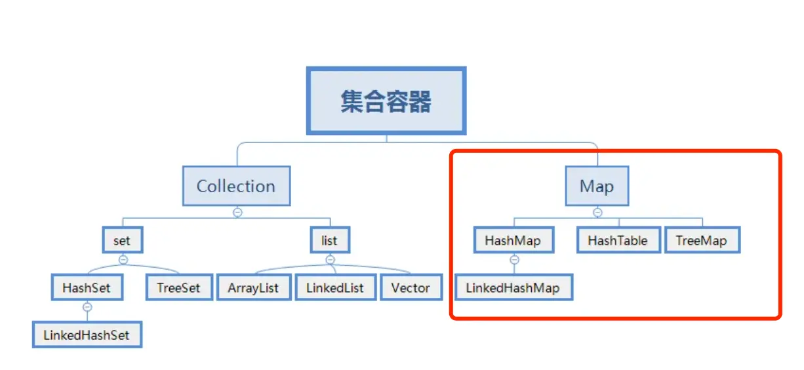
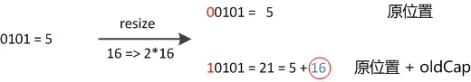
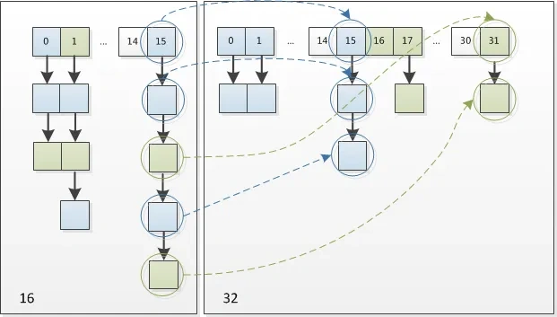
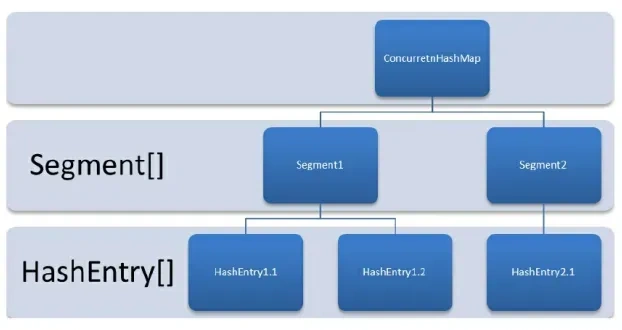
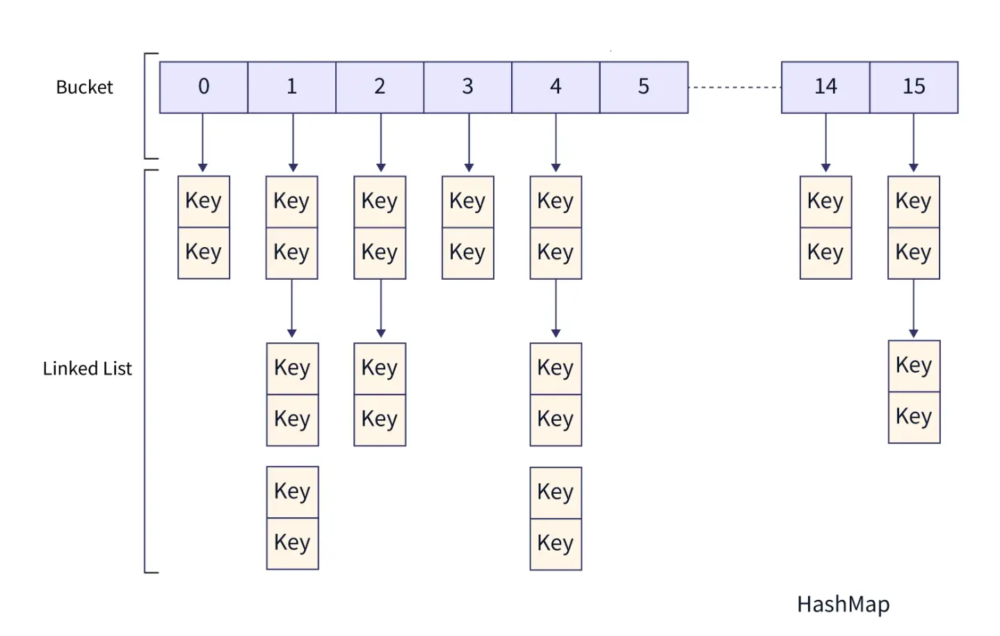

# 2. Java集合面试题

## 2.1 概念

### 2.1.1 数组与集合区别:

1. **长度**：
   - **数组**：固定长度的数据结构，一旦创建长度就无法改变。
   - **集合**：动态长度的数据结构，可以根据需要动态增加或减少元素。
   
2. **内容**：
   - **数组**：可以包含基本数据类型和对象。
   - **集合**：只能包含对象。

3. **访问元素方法**：
   - **数组**：可以直接访问元素。
   - **集合**：需要通过迭代器或其他方法访问元素。

#### 一些Java集合类：

1. **ArrayList**：动态数组，实现了 `List` 接口，支持动态增长。
2. **LinkedList**：双向链表，也实现了 `List` 接口，支持快速的插入和删除操作。
3. **HashMap**：基于哈希表的 `Map` 实现，存储键值对，通过键快速查找值。
4. **HashSet**：基于 `HashMap` 实现的 `Set` 集合，用于存储唯一元素。
5. **TreeMap**：基于红黑树实现的有序 `Map` 集合，可以按照键的顺序进行排序。
6. **LinkedHashMap**：基于哈希表和双向链表实现的 `Map` 集合，保持插入顺序或访问顺序。
7. **PriorityQueue**：优先队列，可以按照比较器或元素的自然顺序进行排序。

---

### 2.1.2 Java中的集合:


#### List:

`List` 是有序的 `Collection`，使用此接口能够精确控制每个元素的插入位置，用户可以根据索引访问 `List` 中元素。

- **有序**：元素在 `List` 中的存储顺序是固定的，即元素的插入顺序会被保留。
- **索引访问**：通过索引可以访问 `List` 中的元素，索引即元素在 `List` 中的顺序。

常用的实现类：

- **ArrayList**：容量可变的非线程安全列表，底层使用数组实现。支持快速随机访问，但插入和删除速度较慢。
  - **底层实现**：使用数组实现。
  - **扩容机制**：当数组容量满时，`ArrayList` 会将数组扩容到原来容量的 1.5 倍。
  - **查询效率**：支持随机访问，查询效率高。
  - **插入和删除操作**：插入或删除操作需要移动元素，速度较慢。


- **LinkedList**：本质是双向链表，插入和删除速度更快，但随机访问速度较慢。
  - **底层实现**：使用双向链表实现。
  - **查询效率**：不支持随机访问，查询效率低。
  - **插入和删除操作**：在链表的任意位置插入和删除元素效率较高，因为不需要移动其他元素。


#### Set:

`Set` 不允许存在重复的元素，与 `List` 不同，`Set` 中的元素是无序的。

- **无序**：`Set` 中的元素没有固定顺序，插入顺序和存储顺序不一定相同。不同的实现类可能会表现出不同的行为。

常用的实现类：

- **HashSet**：基于 `HashMap` 实现，没有顺序保证，元素的存储顺序可能会变化。由于 `HashSet` 是 `HashMap` 实现的，因此线程不安全。`HashMap` 的 Key 即 `HashSet` 存储的元素，所有 Key 都是用相同的 Value，一个名为 `PRESENT` 的 `Object` 类型常量（表示元素存在）。
  - **底层实现**：使用 `HashMap` 实现。
  - **唯一性**：通过 `HashMap` 的 Key 保证元素唯一性。
  - **无序性**：元素的存储顺序可能会变化，无法保证插入顺序。

- **LinkedHashSet**：继承自 `HashSet`，通过 `LinkedHashMap` 实现，使用双向链表维护元素的插入顺序。
  - **底层实现**：继承自 `HashSet`，使用 `LinkedHashMap` 实现。
  - **有序性**：保持插入顺序。每个元素有两个指针，一个指向上一个元素，一个指向下一个元素。

- **TreeSet**：基于 `TreeMap` 实现，元素按照自然顺序或指定的比较器排序。
  - **底层实现**：通过 `TreeMap` 实现，元素根据自然顺序或通过指定的比较器进行排序。
  - **有序性**：元素会根据比较规则自动排序。
  - **性能**：查找、插入和删除操作的时间复杂度为 O(log n)，效率较高。

#### Map:

`Map` 是一个键值对集合，存储键、值及它们之间的映射。`Key` 无序且唯一；`Value` 不要求有序，允许重复。

- **无序性**：`Map` 中的元素的键 (`Key`) 是无序的且唯一。每个键对应一个值 (`Value`)，值可以重复，但键不能重复。
- **索引访问**：没有继承 `Collection` 接口，从 `Map` 集合中检索元素时，只需提供 `Key` 键对象，就会返回对应的 `Value` 值对象。

常用的实现类：

- **HashMap**：JDK 1.8 之前，`HashMap` 由数组和链表组成，数组是 `HashMap` 的主体，链表则主要解决哈希冲突（“拉链法”解决冲突）。JDK 1.8 以后，`HashMap` 在解决哈希冲突时有了较大的变化，当链表长度大于阈值（默认为 8）时，将链表转化为红黑树，减少搜索时间。
  - **底层实现**：由数组和链表组成。
  - **哈希冲突处理**：使用链表解决哈希冲突，JDK 1.8 后，当链表长度超过阈值时，转换为红黑树，提升性能。
  - **线程安全性**：`HashMap` 是非线程安全的。

- **LinkedHashMap**：`LinkedHashMap` 继承自 `HashMap`，所以它的底层仍然是基于拉链式散列结构（即由数组和链表或红黑树组成）。另外，`LinkedHashMap` 在上面结构的基础上，增加了一条双向链表，使得上面的结构可以保持键值对的插入顺序。同时通过对链表进行相应的操作，实现了访问顺序相关逻辑。
  - **底层实现**：继承自 `HashMap`，增加了双向链表。
  - **有序性**：保持插入顺序或访问顺序。

- **Hashtable**：数组和链表组成，数组是 `Hashtable` 的主体，链表则是主要为了解决哈希冲突而存在的。`Hashtable` 是线程安全的，但性能较差，现已不推荐使用。
  - **底层实现**：数组和链表实现。
  - **线程安全**：每个方法都使用 `synchronized` 锁，性能较差。
  - **不支持 `null` 键和值**：与 `HashMap` 不同，不允许使用 `null` 键或值。

- **TreeMap**：基于红黑树的有序 `Map` 实现，元素根据自然顺序或指定的比较器排序。
  - **底层实现**：基于红黑树。
  - **有序性**：元素根据自然顺序或通过指定的比较器进行排序。
  - **性能**：查找、插入和删除操作的时间复杂度为 O(log n)。

- **ConcurrentHashMap**：线程安全的 `Map`，底层由节点数组、链表和红黑树组成。JDK 1.8 以前使用 `Segment` 锁，1.8 以后使用 `volatile` + `CAS` 或 `synchronized` 实现线程安全。
  - **底层实现**：Node 数组、链表和红黑树。
  - **线程安全性**：通过分段锁、`volatile` 和 `CAS` 操作确保线程安全。
  - **性能**：相比 `Hashtable` 和 `synchronized` 的 `HashMap`，`ConcurrentHashMap` 更高效。

---

### 2.1.3 Java中的线程安全的集合：

#### 在 `java.util` 包中的线程安全的类主要有 2 个，其他都是非线程安全的。

- **Vector**：线程安全的动态数组，其内部方法基本都经过 `synchronized` 修饰。如果不需要线程安全，不建议使用 `Vector`，因为同步会带来额外的性能开销。
  - `Vector` 内部是使用对象数组来保存数据，可以根据需要自动增加容量。当数组已满时，会创建新的数组，并拷贝原有数组的数据。

- **Hashtable**：线程安全的哈希表。`Hashtable` 的加锁方法是给每个方法加上 `synchronized` 关键字，这样锁住的是整个 `Table` 对象。不支持 `null` 键和值，由于同步带来的性能开销，`Hashtable` 已经很少被推荐使用。如果需要保证线程安全的哈希表，推荐使用 `ConcurrentHashMap`。

#### `java.util.concurrent` 包提供的都是线程安全的集合：

##### 并发 Map：

- **ConcurrentHashMap**：
  - 它与 `HashTable` 的主要区别是加锁粒度的不同。
  - 在 JDK 1.7，`ConcurrentHashMap` 使用的是分段锁（Segment 锁），每个 Segment 含有整个 table 的一部分，这样不同分段之间的并发操作互不影响。
  - 在 JDK 1.8，取消了 Segment 字段，直接在 table 元素上加锁，进一步减小了并发冲突的概率。
  - 对于 `put` 操作：
    - 如果 Key 对应的数组元素为 `null`，则通过 CAS（Compare and Swap）操作将其设置为当前值。
    - 如果 Key 对应的数组元素（链表表头或树的根元素）不为 `null`，则对该元素使用 `synchronized` 关键字申请锁，然后进行操作。
    - 如果该 `put` 操作使得当前链表长度超过一定阈值，则将该链表转换为红黑树，提高寻址效率。

- **ConcurrentSkipListMap**：
  - 实现了一个基于 SkipList（跳表）算法的可排序的并发集合。
  - SkipList 是一种可以在对数预期时间内完成搜索、插入、删除等操作的数据结构，通过维护多个指向其他元素的“跳跃”链接来实现高效查找。

##### 并发 Set：

- **ConcurrentSkipListSet**：
  - 是线程安全的有序集合，底层使用 `ConcurrentSkipListMap` 实现。

- **CopyOnWriteArraySet**：
  - 是线程安全的 Set 实现，是线程安全的无序集合，可以理解为线程安全的 `HashSet`。
  - `CopyOnWriteArraySet` 和 `HashSet` 都继承自共同的父类 `AbstractSet`，但它们的实现不同：
    - `HashSet` 是通过“散列表”实现的。
    - `CopyOnWriteArraySet` 是通过“动态数组（`CopyOnWriteArrayList`）”实现的，而不是散列表。

#### 并发 List：

- **CopyOnWriteArrayList**：
  - 它是 `ArrayList` 的线程安全的变体，其中所有写操作（`add`、`set` 等）都通过对底层数组进行全新复制来实现，允许存储 `null` 元素。
  - 即当对象进行写操作时，使用了 `Lock` 锁做同步处理，内部拷贝了原数组，并在新数组上进行添加操作，最后将新数组替换掉旧数组；若进行的读操作，则直接返回结果，操作过程中不需要进行同步。

#### 并发 Queue：

- **ConcurrentLinkedQueue**：
  - 是一个适用于高并发场景下的队列，它通过无锁的方式（CAS）实现了高并发状态下的高性能。
  - 通常，`ConcurrentLinkedQueue` 的性能要好于 `BlockingQueue`。

- **BlockingQueue**：
  - 与 `ConcurrentLinkedQueue` 的使用场景不同，`BlockingQueue` 的主要功能并不是在于提升高并发时的队列性能，而在于简化多线程间的数据共享。
  - `BlockingQueue` 提供一种读写阻塞等待的机制：
    - 如果消费者速度较快，则 `BlockingQueue` 可能被清空，此时消费线程再试图从 `BlockingQueue` 读取数据时就会被阻塞。
    - 反之，如果生产线程较快，则 `BlockingQueue` 可能会被装满，此时生产线程再试图向 `BlockingQueue` 队列装入数据时，会被阻塞等待。

#### 并发 Deque：

- **LinkedBlockingDeque**：
  - 是一个线程安全的双端队列实现。它的内部使用链表结构，每一个节点都维护了一个前驱节点和一个后驱节点。
  - `LinkedBlockingDeque` 没有进行读写锁的分离，因此同一时间只能有一个线程对其进行操作。

- **ConcurrentLinkedDeque**：
  - `ConcurrentLinkedDeque` 是一种基于链接节点的无限并发链表。可以安全地并发执行插入、删除和访问操作。
  - 当许多线程同时访问一个公共集合时，`ConcurrentLinkedDeque` 是一个合适的选择。

---

### 2.1.4 Collections和Collection的区别：

- **Collection** 是 Java 集合框架中的一个接口，它是所有集合类的基础接口。它定义了一组通用的操作和方法，如添加、删除、遍历等，用于操作和管理一组对象。`Collection` 接口有许多实现类，如 `List`、`Set` 和 `Queue` 等。

- **Collections**（注意有一个s）是 Java 提供的一个工具类，位于 `java.util` 包中。它提供了一系列静态方法，用于对集合进行操作和算法。`Collections` 类中的方法包括排序、查找、替换、反转、随机化等等。这些方法可以对实现了 `Collection` 接口的集合进行操作，如 `List` 和 `Set`。

---

### 2.1.5 集合遍历的方法：

- **普通 for 循环**：可以使用带有索引的普通 `for` 循环来遍历 `List`。
   ```java
   List<String> list = new ArrayList<>();
   list.add("A");
   list.add("B");
   list.add("C");

   for (int i = 0; i < list.size(); i++) {
      String element = list.get(i);
      System.out.println(element);
   }
   ```

- **增强 for 循环（for-each 循环）**：用于循环访问数组或集合中的元素，简化了迭代过程。
   ```java
   List<String> list = new ArrayList<>();
   list.add("A");
   list.add("B");
   list.add("C");

   for (String element : list) {
      System.out.println(element);
   }
   ```

- **Iterator 迭代器**：可以使用迭代器来遍历集合，特别适用于需要删除元素的情况，避免了 `ConcurrentModificationException`。
   ```java
   List<String> list = new ArrayList<>();
   list.add("A");
   list.add("B");
   list.add("C");

   Iterator<String> iterator = list.iterator();
   while(iterator.hasNext()) {
      String element = iterator.next();
      System.out.println(element);
   }
   ```

- **ListIterator 列表迭代器**：`ListIterator` 是 `Iterator` 的子类，支持双向访问列表，并且可以在迭代过程中修改元素。
   ```java
   List<String> list = new ArrayList<>();
   list.add("A");
   list.add("B");
   list.add("C");

   ListIterator<String> listIterator= list.listIterator();
   while(listIterator.hasNext()) {
      String element = listIterator.next();
      System.out.println(element);
   }
   ```

- **使用 forEach 方法**：Java 8 引入了 `forEach` 方法，可以对集合进行快速遍历，简化了代码，支持传入 Lambda 表达式。
   ```java
   List<String> list = new ArrayList<>();
   list.add("A");
   list.add("B");
   list.add("C");

   list.forEach(element -> System.out.println(element));
   ```

- **Stream API**：Java 8 的 `Stream` API 提供了丰富的函数式操作，可以对集合进行过滤、映射等操作，支持链式调用。
   ```java
   List<String> list = new ArrayList<>();
   list.add("A");
   list.add("B");
   list.add("C");

   list.stream().forEach(element -> System.out.println(element));
   ```
 
---

## 2.2 List：


#### 常见的 List 集合（非线程安全）：

- **ArrayList**：基于动态数组实现，它允许快速的随机访问，即通过索引访问元素的时间复杂度为 O(1)。在添加和删除元素时，如果操作位置不是列表末尾，可能需要移动大量元素，性能相对较低。适用于需要频繁随机访问元素，而对插入和删除操作性能要求不高的场景，如数据的查询和展示等。

- **LinkedList**：基于双向链表实现，在插入和删除元素时，只需修改链表的指针，不需要移动大量元素，时间复杂度为 O(1)。但随机访问元素时，需要从链表头或链表尾开始遍历，时间复杂度为 O(n)。适用于需要频繁进行插入和删除操作的场景，如队列、栈等数据结构的实现，以及需要在列表中间频繁插入和删除元素的情况。

#### 常见的 List 集合（线程安全）：

- **Vector**：与 `ArrayList` 类似，也是基于数组实现。`Vector` 中的方法大多是同步的，这使得它在多线程环境下可以保证数据的一致性，但在单线程环境下，由于同步带来的开销，性能会略低于 `ArrayList`。

- **CopyOnWriteArrayList**：在对列表进行修改（如添加、删除元素）时，会创建一个新的底层数组，将修改操作应用到新数组上，而读操作仍然在原数组上进行，这样可以保证读操作不会被写操作阻塞，实现了读写分离，提高了并发性能。适用于读操作远远多于写操作的并发场景，如事件监听列表等，在这种场景下可以避免大量的锁竞争，提高系统的性能和响应速度。

---

### 2.2.1 Java里面List的几种实现：

在 Java 中，`List` 接口是最常用的集合类型之一，用于存储元素的有序集合。以下是 Java 中常见的 `List` 实现及其特点：


- **Vector**：
  - 是 Java 早期提供的线程安全的动态数组实现。
  - 如果不需要线程安全，通常不建议使用 `Vector`，因为同步机制会带来额外的性能开销。
  - `Vector` 内部使用对象数组来保存数据，可以自动扩展容量。当数组已满时，会创建新的数组，并拷贝原有的数据。
  - 适合需要线程安全的场景，但在单线程环境下性能较差。

- **ArrayList**：
  - 是应用最广泛的动态数组实现，不是线程安全的，因此性能较好。
  - 和 `Vector` 类似，`ArrayList` 也可以根据需要扩展容量，但其扩容机制与 `Vector` 不同：`ArrayList` 每次扩容会增加 50% 的容量，而 `Vector` 扩容时会加倍容量。
  - 适合频繁访问元素的场景，但在插入和删除操作时，特别是中间插入和删除，会有较差的性能。

- **LinkedList**：
  - 是 Java 提供的双向链表实现，不需要像 `Vector` 和 `ArrayList` 那样调整容量。
  - 它本身不是线程安全的。
  - `LinkedList` 在节点的插入和删除操作上非常高效，但在随机访问时性能较差，因为它需要遍历链表来查找元素。
  - 适合需要频繁插入和删除元素的场景，但不适合频繁随机访问元素的场景。

#### 选择场景：

- **Vector 和 ArrayList**：作为动态数组，它们内部的元素以顺序存储的数组形式进行存储，因此非常适合随机访问的场合。然而，除了在尾部插入和删除元素外，其他位置的插入和删除性能较差，因为需要移动大量元素（特别是中间插入时）。
  
- **LinkedList**：虽然 `LinkedList` 的随机访问性能较差，但它在插入和删除操作上非常高效，尤其是在链表的头部和中间位置。因此，适用于需要频繁进行节点插入、删除操作的场景，但不适合频繁进行随机访问的场合。

---

### 2.2.2 list 可以一边遍历一边修改元素吗：

在 Java 中，`List` 在遍历过程中是否可以修改元素取决于遍历方式和具体的 `List` 实现类，以下是几种常见情况：

- **使用普通 for 循环遍历**：
  - 可以在遍历过程中修改元素，只要修改的索引不超出 `List` 的范围即可。
  ```java
  import java.util.ArrayList;
  import java.util.List;

  public class ListTraversalAndModification {
      public static void main(String[] args) {
          List<Integer> list = new ArrayList<>();
          list.add(1);
          list.add(2);
          list.add(3);

          // 使用普通for循环遍历并修改元素
          for (int i = 0; i < list.size(); i++) {
              list.set(i, list.get(i) * 2);
          }

          System.out.println(list);
      }
  }
  ```


- **使用 foreach 循环遍历**：
  - 一般不建议在 `foreach` 循环中直接修改正在遍历的 `List` 元素，因为这可能会导致意外的结果或 `ConcurrentModificationException` 异常。
  - `foreach` 循环底层是基于迭代器实现的，在遍历过程中修改集合结构（如添加、删除元素），会导致迭代器的预期结构与实际结构不一致，从而引发异常。
  ```java
  import java.util.ArrayList;
  import java.util.List;

  public class ListTraversalAndModification {
      public static void main(String[] args) {
          List<Integer> list = new ArrayList<>();
          list.add(1);
          list.add(2);
          list.add(3);

          // 使用foreach循环遍历并尝试修改元素，会抛出ConcurrentModificationException异常
          for (Integer num : list) {
              list.set(list.indexOf(num), num * 2);
          }

          System.out.println(list);
      }
  }
  ```


- **使用迭代器遍历**：
  - 可以使用迭代器的 `remove` 方法来删除元素，但如果要修改元素的值，需要通过迭代器的 `set` 方法来进行，而不是直接通过 `List` 的 `set` 方法。
  - 如果直接通过 `List` 的 `set` 方法修改元素，可能会抛出 `ConcurrentModificationException` 异常。
  ```java
  import java.util.ArrayList;
  import java.util.Iterator;
  import java.util.List;

  public class ListTraversalAndModification {
      public static void main(String[] args) {
          List<Integer> list = new ArrayList<>();
          list.add(1);
          list.add(2);
          list.add(3);

          // 使用迭代器遍历并修改元素
          Iterator<Integer> iterator = list.iterator();
          while (iterator.hasNext()) {
              Integer num = iterator.next();
              if (num == 2) {
                  // 使用迭代器的set方法修改元素
                  iterator.set(4);
              }
          }

          System.out.println(list);
      }
  }
  ```


- **对于线程安全的 List，如 `CopyOnWriteArrayList`**：
  - 由于其采用了写时复制的机制，在遍历的同时可以进行修改操作，不会抛出 `ConcurrentModificationException` 异常。
  - 但需要注意，修改操作是在新的副本上进行的，因此可能会读取到旧的数据。

---

### 2.2.3 list 如何快速删除某个指定下标的元素：

- **ArrayList**：
  - `ArrayList` 提供了 `remove(int index)` 方法来删除指定下标的元素。该方法在删除元素后，会将后续元素向前移动，以填补被删除元素的位置。
  - 如果删除的是列表末尾的元素，时间复杂度为 `O(1)`；如果删除的是列表中间的元素，时间复杂度为 `O(n)`，其中 `n` 为列表中元素的个数，因为需要移动后续的元素。
  ```java
  import java.util.ArrayList;
  import java.util.List;

  public class ArrayListRemoveExample {
      public static void main(String[] args) {
          List<Integer> list = new ArrayList<>();
          list.add(1);
          list.add(2);
          list.add(3);

          // 删除下标为1的元素
          list.remove(1);

          System.out.println(list);
      }
  }
  ```


- **LinkedList**：
  - `LinkedList` 的 `remove(int index)` 方法也可以用来删除指定下标的元素。它需要先遍历到指定下标位置，然后修改链表的指针来删除元素。时间复杂度为 `O(n)`，其中 `n` 为要删除元素的下标。
  - 不过，如果已知要删除的元素是链表的头节点或尾节点，可以直接通过修改头指针或尾指针来实现删除，时间复杂度为 `O(1)`。
  ```java
  import java.util.LinkedList;
  import java.util.List;

  public class LinkedListRemoveExample {
      public static void main(String[] args) {
          List<Integer> list = new LinkedList<>();
          list.add(1);
          list.add(2);
          list.add(3);

          // 删除下标为1的元素
          list.remove(1);

          System.out.println(list);
      }
  }
  ```


- **CopyOnWriteArrayList**：
  - `CopyOnWriteArrayList` 的 `remove` 方法同样可以删除指定下标的元素。由于 `CopyOnWriteArrayList` 在写操作时会创建一个新的数组，所以删除操作的时间复杂度取决于数组的复制速度，通常为 `O(n)`，其中 `n` 为数组的长度。
  - 但在并发环境下，它的删除操作不会影响读操作，具有较好的并发性能。
  ```java
  import java.util.concurrent.CopyOnWriteArrayList;

  public class CopyOnWriteArrayListRemoveExample {
      public static void main(String[] args) {
          CopyOnWriteArrayList<Integer> list = new CopyOnWriteArrayList<>();
          list.add(1);
          list.add(2);
          list.add(3);

          // 删除下标为1的元素
          list.remove(1);

          System.out.println(list);
      }
  }
  ```

---

### 2.2.4 ArrayList 和 LinkedList 的区别：

- **底层数据结构**：
  - `ArrayList` 使用数组实现，通过索引进行快速访问元素。
  - `LinkedList` 使用链表实现，通过节点之间的指针进行元素的访问和操作。

- **插入和删除操作的效率**：
  - `ArrayList` 在尾部的插入和删除操作效率较高，但在中间或开头的插入和删除操作效率较低，因为需要移动元素。
  - `LinkedList` 在任意位置的插入和删除操作效率较高，因为只需要调整节点之间的指针，但 `LinkedList` 不支持随机访问，所以除了头结点外，插入和删除的时间复杂度是 `O(n)`，效率较低。因此，`LinkedList` 基本上不常用。

- **随机访问的效率**：
  - `ArrayList` 支持通过索引进行快速随机访问，时间复杂度为 `O(1)`。
  - `LinkedList` 需要从头或尾开始遍历链表，时间复杂度为 `O(n)`。

- **空间占用**：
  - `ArrayList` 在创建时需要分配一段连续的内存空间，因此会占用较大的空间。
  - `LinkedList` 每个节点只需要存储元素和指针，因此相对较小。

- **使用场景**：
  - `ArrayList` 适用于频繁随机访问和尾部的插入删除操作。
  - `LinkedList` 适用于频繁的中间插入删除操作和不需要随机访问的场景。

- **线程安全**：
  - `ArrayList` 和 `LinkedList` 都不是线程安全的。
  - `Vector` 是线程安全的。

---

### 2.2.5 ArrayList 线程安全吗？把 ArrayList 变成线程安全有哪些方法？

`ArrayList` 不是线程安全的，以下是将 `ArrayList` 变成线程安全的几种方法：

- **使用 `Collections` 类的 `synchronizedList` 方法将 `ArrayList` 包装成线程安全的 List**：
  - `Collections.synchronizedList(list)` 可以将一个普通的 `ArrayList` 包装成线程安全的 `List`。但是需要注意，使用该方法时，仍然需要手动同步外部操作。
  ```java
  List<String> synchronizedList = Collections.synchronizedList(arrayList);
  ```


- **使用 `CopyOnWriteArrayList` 类代替 `ArrayList`**：
  - `CopyOnWriteArrayList` 是一个线程安全的 `List` 实现。它通过写时复制的方式保证线程安全，即在写操作时，复制整个数组来进行修改，这样读取操作不会被阻塞。
  ```java
  CopyOnWriteArrayList<String> copyOnWriteArrayList = new CopyOnWriteArrayList<>(arrayList);
  ```

- **使用 `Vector` 类代替 `ArrayList`**：
  - `Vector` 是一个线程安全的 `List` 实现，它通过在方法上加 `synchronized` 锁来确保线程安全。然而，由于同步带来的性能开销，`Vector` 的性能通常不如 `ArrayList`。
  ```java
  Vector<String> vector = new Vector<>(arrayList);
  ```

---

### 2.2.6 为什么 ArrayList 不是线程安全的，具体来说是哪里不安全？

在高并发添加数据时，`ArrayList` 会暴露出三个问题：

- 部分值为 `null`（我们并没有 `add null` 进去）
- 索引越界异常
- `size` 与我们 `add` 的数量不符

`ArrayList` 中的 `add` 方法通过以下步骤工作：

```java
public boolean add(E e) {
        ensureCapacityInternal(size + 1);  // Increments modCount!!
        elementData[size++] = e;
        return true;
}
```

`ensureCapacityInternal()` 方法的作用是判断当前新元素加入时，`ArrayList` 的底层 `elementData` 数组的容量是否足够。如果 `size + 1` 的需求大于当前数组的容量，它就会触发数组的扩容。


1. 判断数组需不需要扩容，如果需要的话，调用`grow`方法进行扩容
2. 将数组的`size`位置设置值（因为数组的下标是从0开始的
3. 将当前集合的大小加1

下面我们来分析三种情况是如何发生的：

1. **部分值为 `null`**：
   - 线程1发现当前 `size` 是 9，而数组容量是 10，所以不需要扩容。
   - 这时 CPU 让出执行权，线程2进来，发现 `size` 仍然是 9，数组容量是 10，所以也不需要扩容。
   - 线程1继续执行，将数组下标索引为 9 的位置设置值，但还没有执行 `size++`。
   - 线程2执行时，再次将数组下标索引为 9 的位置设置了一遍，这样线程1和线程2都执行了 `size++`，导致 `size` 被增加了两次，但数组的最后一个位置（索引 10）依然为 `null`。

2. **索引越界异常**：
   - 线程1发现当前 `size` 是 9，数组容量是 10，所以不需要扩容。
   - CPU 让出执行权，线程2进来，发现数组容量为 10，因此也没有扩容。
   - 线程1完成 `set` 操作后，执行 `size++`，此时 `size` 变成 10。
   - 线程2执行时，由于 `size` 已经是 10，而数组的最大索引为 9，线程2试图将元素添加到下标索引为 10 的位置时，就会发生索引越界异常。
  
3. **`size` 与我们 `add` 的数量不符**：
   - 由于 `size++` 不是原子操作，它分为三个步骤：获取 `size` 的值、将 `size` 加1、将新的 `size` 值覆盖原值。
   - 线程1和线程2可能会同时读取到相同的 `size` 值并分别进行自增，最终导致 `size` 的更新不准确，造成 `size` 的值与实际添加的元素数量不符。

---

### 2.2.7 ArrayList 和 LinkedList 的应用场景？

- **ArrayList**：适用于需要频繁访问集合元素的场景。ArrayList基于数组实现，可以通过索引快速访问元素。因此，在按索引查找、遍历和随机访问元素的操作上具有较高的性能。推荐使用ArrayList的场景包括：
  - 频繁访问集合中的元素
  - 集合大小不经常改变

- **LinkedList**：适用于频繁进行插入和删除操作的场景。LinkedList基于链表实现，插入和删除元素的操作只需要调整节点的指针，因此在这些操作上具有较高的性能。推荐使用LinkedList的场景包括：
  - 频繁插入和删除操作
  - 集合大小经常改变

---

### 2.2.8 ArrayList的扩容机制

ArrayList的扩容机制在元素个数达到数组容量上限时自动触发。扩容过程包括以下步骤：
1. **计算新容量**：通常，新容量为原容量的1.5倍（JDK 10之后扩容策略有所调整），然后检查是否超过最大容量限制。
2. **创建新数组**：根据新的容量创建一个更大的数组。
3. **复制元素**：将原数组中的元素逐个复制到新数组中。
4. **更新引用**：将ArrayList内部指向原数组的引用更新为新数组。
5. **完成扩容**：扩容后，新的元素可以继续添加。

ArrayList的扩容操作涉及到数组的复制和内存的重新分配，所以在频繁添加大量元素时，扩容操作可能会影响性能。为了减少扩容带来的性能损耗，可以在初始化ArrayList时预分配足够大的容量，避免频繁触发扩容操作。

扩容因子1.5倍是因为它能平衡内存使用和性能，减少计算和运算次数。
```java
// 新容量计算
int newCapacity = oldCapacity + (oldCapacity >> 1);
```

---

### 2.2.9 线程安全的 List， CopyOnWriteArrayList是如何实现线程安全的

**CopyOnWriteArrayList**底层通过数组保存数据，并使用`volatile`关键字修饰数组，确保线程对数组对象进行修改时，其他线程能及时看到修改后的数据。
```java
private transient volatile Object[] array;
```

在写入操作时，加了一把互斥锁`ReentrantLock`以保证线程安全。
```java
public boolean add(E e) {
    //获取锁
    final ReentrantLock lock = this.lock;
    //加锁
    lock.lock();
    try {
        //获取到当前List集合保存数据的数组
        Object[] elements = getArray();
        //获取该数组的长度（这是一个伏笔，同时len也是新数组的最后一个元素的索引值）
        int len = elements.length;
        //将当前数组拷贝一份的同时，让其长度加1
        Object[] newElements = Arrays.copyOf(elements, len + 1);
        //将加入的元素放在新数组最后一位，len不是旧数组长度吗，为什么现在用它当成新数组的最后一个元素的下标？建议自行画图推演，就很容易理解。
        newElements[len] = e;
        //替换引用，将数组的引用指向给新数组的地址
        setArray(newElements);
        return true;
    } finally {
        //释放锁
        lock.unlock();
    }
}
```
写入新元素时，CopyOnWriteArrayList 会执行以下步骤：

1. **复制原数组**：首先会将原数组拷贝一份，并将新数组的长度增加1，得到一个新的数组。
2. **添加新元素**：将新加入的元素放到新数组的最后一个位置。
3. **替换数组引用**：然后将新数组的引用替换掉原数组的引用，完成数据更新。

在这个过程中：
- **读取操作**：在替换数组引用之前，读取的是原数组的数据，这些数据是有效的。
- **数据一致性**：替换数组引用后，读取的是新数组的数据，保证数据的一致性。
- **效率**：由于只有写操作需要加锁，读操作不加锁，所以相比于传统的读写都加锁的方式，这种机制能够提高性能和并发效率。


现在我们来看读操作，读是没有加锁的，所以读是一直都能读
```java
public E get(int index) {
    return get(getArray(), index);
}
```

---

## 2.3 Map：



#### 常见的 Map 集合（非线程安全）：

- **HashMap**：
  - 基于哈希表实现，根据键的哈希值来存储和获取键值对。
  - JDK 1.8 中使用数组 + 链表 + 红黑树实现。
  - 非线程安全，在多线程环境下，多个线程同时操作可能导致数据不一致或死循环等问题。例如，在扩容时，多个线程同时修改哈希表的结构可能会破坏数据完整性。

- **LinkedHashMap**：
  - 继承自 HashMap，使用双向链表维护键值对的插入顺序或访问顺序。
  - 由于继承自 HashMap，它在多线程并发访问时，仍然会出现与 HashMap 类似的线程安全问题。

- **TreeMap**：
  - 基于红黑树实现，可以对键进行排序，默认按照自然顺序排序，也可以通过指定的比较器进行排序。
  - 非线程安全，在多线程环境下，多个线程同时进行插入、删除等操作可能会破坏红黑树结构，导致数据不一致或程序异常。

#### 常见的 Map 集合（线程安全）：

- **Hashtable**：
  - 早期 Java 提供的线程安全的 Map 实现，使用 synchronized 关键字保证线程安全。
  - 通过在每个可能修改 Hashtable 状态的方法上加 synchronized，使得同一时刻只能有一个线程访问这些方法，从而保证线程安全。

- **ConcurrentHashMap**：
  - 在 JDK 1.8 以前采用分段锁等技术提高并发性能。
  - 将数据分成多个段（Segment），每个段有自己的锁，进行插入、删除等操作时，只需要获取相应段的锁，而不是整个 Map 的锁，允许多个线程同时访问不同段。
  - JDK 1.8 以后通过 volatile + CAS 或 synchronized 来保证线程安全。

### 2.3.1 如何对map进行快速遍历？

1. **使用 for-each 循环和 entrySet() 方法**：
   - 这是一种较为常见和简洁的遍历方式，可以同时获取 Map 中的键和值。
    ```java
    import java.util.HashMap;
    import java.util.Map;

    public class MapTraversalExample {
        public static void main(String[] args) {
            Map<String, Integer> map = new HashMap<>();
            map.put("key1", 1);
            map.put("key2", 2);
            map.put("key3", 3);

            // 使用for-each循环和entrySet()遍历Map
            for (Map.Entry<String, Integer> entry : map.entrySet()) {
                System.out.println("Key: " + entry.getKey() + ", Value: " + entry.getValue());
            }
        }
    }
    ```


2. **使用 for-each 循环和 keySet() 方法**：
   - 如果只需要遍历 Map 中的键，可以使用 keySet() 方法，这种方式相对简单，性能也较好。
    ```java
    import java.util.HashMap;
    import java.util.Map;

    public class MapTraversalExample {
        public static void main(String[] args) {
            Map<String, Integer> map = new HashMap<>();
            map.put("key1", 1);
            map.put("key2", 2);
            map.put("key3", 3);

            // 使用for-each循环和keySet()遍历Map的键
            for (String key : map.keySet()) {
                System.out.println("Key: " + key + ", Value: " + map.get(key));
            }
        }
    }
    ```

3. **使用迭代器**：
   - 通过获取 Map 的 entrySet() 或 keySet() 的迭代器，也可以实现对 Map 的遍历。在需要删除元素等操作时，这种方式比较有用。
    ```java
    import java.util.HashMap;
    import java.util.Iterator;
    import java.util.Map;
    import java.util.Map.Entry;

    public class MapTraversalExample {
        public static void main(String[] args) {
            Map<String, Integer> map = new HashMap<>();
            map.put("key1", 1);
            map.put("key2", 2);
            map.put("key3", 3);

            // 使用迭代器遍历Map
            Iterator<Entry<String, Integer>> iterator = map.entrySet().iterator();
            while (iterator.hasNext()) {
                Entry<String, Integer> entry = iterator.next();
                System.out.println("Key: " + entry.getKey() + ", Value: " + entry.getValue());
            }
        }
    }
    ```

4. **使用 Lambda 表达式和 forEach() 方法**：
   - 在 Java 8 及以上版本中，可以使用 Lambda 表达式和 forEach() 方法来遍历 Map，这种方式更加简洁和函数式。
    ```java
    import java.util.HashMap;
    import java.util.Map;

    public class MapTraversalExample {
        public static void main(String[] args) {
            Map<String, Integer> map = new HashMap<>();
            map.put("key1", 1);
            map.put("key2", 2);
            map.put("key3", 3);

            // 使用Lambda表达式和forEach()方法遍历Map
            map.forEach((key, value) -> System.out.println("Key: " + key + ", Value: " + value));
        }
    }
    ```

5. **使用 Stream API**：
   - Java 8 引入的 Stream API 也可以用于遍历 Map，可以将 Map 转换为流，然后进行各种操作。
    ```java
    import java.util.HashMap;
    import java.util.Map;
    import java.util.stream.Collectors;

    public class MapTraversalExample {
        public static void main(String[] args) {
            Map<String, Integer> map = new HashMap<>();
            map.put("key1", 1);
            map.put("key2", 2);
            map.put("key3", 3);

            // 使用Stream API遍历Map
            map.entrySet().stream()
              .forEach(entry -> System.out.println("Key: " + entry.getKey() + ", Value: " + entry.getValue()));

            // 还可以进行其他操作，如过滤、映射等
            Map<String, Integer> filteredMap = map.entrySet().stream()
                                                .filter(entry -> entry.getValue() > 1)
                                                .collect(Collectors.toMap(Map.Entry::getKey, Map.Entry::getValue));
            System.out.println(filteredMap);
        }
    }
    ```

### 2.3.2 HashMap实现原理

在 JDK 1.7 版本之前， HashMap 数据结构是数组和链表，HashMap通过哈希算法将元素的键（Key）映射到数组中的槽位（Bucket）。如果多个键映射到同一个槽位，它们会以链表的形式存储在同一个槽位上，因为链表的查询时间是O(n)，所以冲突很严重，一个索引上的链表非常长，效率就很低了。


所以在 JDK 1.8 版本的时候做了优化，当一个链表的长度超过8的时候就转换数据结构，不再使用链表存储，而是使用红黑树，查找时使用红黑树，时间复杂度O（log n），可以提高查询性能，但是在数量较少时，即数量小于6时，会将红黑树转换回链表。


### 2.3.3 哈希冲突解决方法

### 2.3.3 哈希冲突解决方法

1. **链接法**：使用链表或其他数据结构来存储冲突的键值对，将它们链接在同一个哈希桶中。

2. **开放寻址法**：在哈希表中找到另一个可用的位置来存储冲突的键值对，而不是存储在链表中。常见的开放寻址方法包括：
   - 线性探测
   - 二次探测
   - 双重散列

3. **再哈希法（Rehashing）**：当发生冲突时，使用另一个哈希函数再次计算键的哈希值，直到找到一个空槽来存储键值对。

4. **哈希桶扩容**：当哈希冲突过多时，可以动态地扩大哈希桶的数量，重新分配键值对，以减少冲突的概率。


### 2.3.4 HashMap是线程安全的吗?

HashMap **不是线程安全**的，在多线程环境下会出现以下问题：

- **JDK 1.7**：HashMap 采用数组 + 链表的数据结构，在多线程环境下，数组扩容时可能会出现 Entry 链表死循环和数据丢失问题。
  
- **JDK 1.8**：HashMap 采用数组 + 链表 + 红黑树的数据结构，优化了 1.7 中扩容时的问题，解决了 Entry 链死循环和数据丢失问题。但在多线程环境下，`put` 方法仍然可能导致数据覆盖问题。

如果需要保证线程安全，可以采用以下方式：

- 使用 `Collections.synchronizedMap` 进行同步加锁；
- 使用 `Hashtable`，它本身是线程安全的；
- 使用 `ConcurrentHashMap`，它在高并发场景下表现更优。

**ConcurrentHashMap** 在 JDK 1.7 和 1.8 中做了较大改动：
- **JDK 1.7**：采用分段锁（`Segment + HashEntry`）实现；
- **JDK 1.8**：抛弃了分段锁，改为使用 `CAS + synchronized + Node`，并引入了红黑树来避免链表过长导致的性能问题。


### 2.3.5 HashMap的put过程


HashMap 的 `put()` 方法用于向 HashMap 中添加键值对，当调用 `put()` 方法时，会按照以下详细流程执行（JDK 1.8版本）：

1. **第一步**：根据要添加的键的哈希码计算在数组中的位置（索引）。

2. **第二步**：检查该位置是否为空（即没有键值对存在）。
   - 如果为空，则直接在该位置创建一个新的 `Entry` 对象来存储键值对。将要添加的键值对作为该 `Entry` 的键和值，并保存在数组的对应位置。此时，将 `modCount` 加 1，以便在进行迭代时发现并发修改。

3. **第三步**：如果该位置已经存在其他键值对，检查该位置的第一个键值对的哈希码和键是否与要添加的键值对相同。
   - 如果相同，则表示找到了相同的键，直接将新的值替换旧的值，完成更新操作。

4. **第四步**：如果第一个键值对的哈希码和键不相同，则需要遍历链表或红黑树来查找是否有相同的键：
   - 如果键值对集合是链表结构，从链表的头部开始逐个比较键的哈希码和 `equals()` 方法，直到找到相同的键或达到链表末尾。
   - 如果找到了相同的键，则使用新的值取代旧的值，即更新键对应的值。
   - 如果没有找到相同的键，则将新的键值对添加到链表的头部。
   
   - 如果键值对集合是红黑树结构，在红黑树中使用哈希码和 `equals()` 方法进行查找。根据键的哈希码，定位到红黑树中的某个节点，然后逐个比较键，直到找到相同的键或达到红黑树末尾。
   - 如果找到了相同的键，则使用新的值取代旧的值，即更新键对应的值。
   - 如果没有找到相同的键，则将新的键值对添加到红黑树中。

5. **第五步**：检查链表长度是否达到阈值（默认为 8）：
   - 如果链表长度超过阈值，且 HashMap 的数组长度大于等于 64，则会将链表转换为红黑树，以提高查询效率。

6. **第六步**：检查负载因子是否超过阈值（默认为 0.75）：
   - 如果键值对的数量（`size`）与数组的长度的比值大于阈值，则需要进行扩容操作。

7. **第七步**：扩容操作：
   - 创建一个新的两倍大小的数组。
   - 将旧数组中的键值对重新计算哈希码并分配到新数组中的位置。
   - 更新 HashMap 的数组引用和阈值参数。

8. **第八步**：完成添加操作。

此外，HashMap 是非线程安全的，如果在多线程环境下使用，需要采取额外的同步措施或使用线程安全的 `ConcurrentHashMap`。

### 2.3.6 HashMap的put(key, val)和get(key)过程

存储对象时，我们将 K/V 传给 `put` 方法时，它调用 `hashCode` 计算 hash 从而得到 bucket 位置，进一步存储。HashMap 会根据当前 bucket 的占用情况自动调整容量（超过 Load Factor 则 resize 为原来的 2 倍）。
  
获取对象时，我们将 K 传给 `get`，它调用 `hashCode` 计算 hash 从而得到 bucket 位置，并进一步调用 `equals()` 方法确定键值对。如果发生碰撞时，HashMap 通过链表将产生碰撞冲突的元素组织起来。在 Java 8 中，如果一个 bucket 中碰撞冲突的元素超过某个限制（默认是 8），则使用红黑树来替换链表，从而提高速度。

### 2.3.7 HashMap 调用 get 方法一定安全吗？

不是，调用 `get` 方法有几点需要注意的地方：

- **空指针异常（NullPointerException）**：如果你尝试用 `null` 作为键调用 `get` 方法，而 HashMap 没有被初始化（即为 `null`），那么会抛出空指针异常。不过，如果 HashMap 已经初始化，使用 `null` 作为键是允许的，因为 HashMap 支持 `null` 键。
- **线程安全**：HashMap 本身不是线程安全的。如果在多线程环境中，没有适当的同步措施，同时对 HashMap 进行读写操作可能会导致不可预测的行为。例如，在一个线程中调用 `get` 方法读取数据，而另一个线程同时修改了结构（如增加或删除元素），可能会导致读取操作得到错误的结果或抛出 `ConcurrentModificationException`。如果需要在多线程环境中使用类似 HashMap 的数据结构，可以考虑使用 `ConcurrentHashMap`。

### 2.3.8 HashMap 一般用什么做 Key？为啥 String 适合做 Key 呢？

用 `String` 做 Key，因为 `String` 对象是不可变的，一旦创建就不能被修改，这确保了 Key 的稳定性。如果 Key 是可变的，可能会导致 `hashCode` 和 `equals` 方法的不一致，进而影响 HashMap 的正确性。

### 2.3.9 为什么 HashMap 要用红黑树而不是平衡二叉树？

平衡二叉树追求的是一种 "完全平衡" 状态：任何节点的左右子树的高度差不会超过 1，优势是树的节点是很平均分配的。这个要求实在是太严了，导致每次进行插入/删除节点的时候，几乎都会破坏平衡树的第二个规则，进而我们都需要通过左旋和右旋来进行调整，使之再次成为一颗符合要求的平衡树。

红黑树不追求这种完全平衡状态，而是追求一种 "弱平衡" 状态：整个树最长路径不会超过最短路径的 2 倍。优势是虽然牺牲了一部分查找的性能效率，但是能够换取一部分维持树平衡状态的成本。与平衡树不同的是，红黑树在插入、删除等操作中，不会像平衡树那样，频繁地破坏红黑树的规则，所以不需要频繁地调整，这也是我们大多数情况下使用红黑树的原因。

### 2.3.10 HashMap key 可以为 null 吗？

可以为 `null`。

HashMap 中使用 `hash()` 方法来计算 key 的哈希值，当 key 为空时，直接将 key 的哈希值设为 0，不走 `key.hashCode()` 方法；

HashMap 虽然支持 `key` 和 `value` 为 `null`，但是 `null` 作为 `key` 只能有一个，`null` 作为 `value` 可以有多个；
因为 HashMap 中，如果 `key` 值一样，那么会覆盖相同 `key` 值的 `value` 为最新，所以 `key` 为 `null` 只能有一个。

### 2.3.11 重写 HashMap 的 `equals` 和 `hashCode` 方法需要注意什么？

HashMap 使用 `Key` 对象的 `hashCode()` 和 `equals()` 方法去决定 key-value 对的索引。当我们试着从 HashMap 中获取值时，这些方法也会被用到。如果这些方法没有被正确地实现，在这种情况下，两个不同 `Key` 也许会产生相同的 `hashCode()` 和 `equals()` 输出，HashMap 将会认为它们是相同的，然后覆盖它们，而非把它们存储到不同的地方。

同样的，所有不允许存储重复数据的集合类都使用 `hashCode()` 和 `equals()` 去查找重复，所以正确实现它们非常重要。`equals()` 和 `hashCode()` 的实现应该遵循以下规则：

- 如果 `o1.equals(o2)`，那么 `o1.hashCode() == o2.hashCode()` 总是为 true 的。
- 如果 `o1.hashCode() == o2.hashCode()`，并不意味着 `o1.equals(o2)` 会为 true。

### 2.3.12 重写 HashMap 的 `equals` 方法不当会出现什么问题？

HashMap 在比较元素时，会先通过 `hashCode` 进行比较，相同的情况下再通过 `equals` 进行比较。

所以 `equals` 相等的两个对象，`hashCode` 一定相等。`hashCode` 相等的两个对象，`equals` 不一定相等（比如散列冲突的情况）。

重写了 `equals` 方法，不重写 `hashCode` 方法时，可能会出现 `equals` 方法返回为 true，而 `hashCode` 方法却返回 false，这样的一个后果会导致在 HashMap 等类中存储多个一模一样的对象，导致出现覆盖存储的数据的问题，这与 HashMap 只能有唯一的 `key` 的规范不符合。

### 2.3.13 列举 HashMap 在多线程下可能会出现的问题

- JDK1.7 中的 HashMap 使用头插法插入元素，在多线程环境下，扩容时可能会导致环形链表的出现，形成死循环。因此，JDK1.8 使用尾插法插入元素，扩容时能保持链表元素原本的顺序，避免出现环形链表问题。
- 多线程同时执行 `put` 操作时，如果计算出来的索引位置相同，会造成前一个 key 被后一个 key 覆盖，从而导致元素丢失。此问题在 JDK1.7 和 JDK1.8 中都存在。

### 2.3.14 HashMap 的扩容机制

- 默认负载因子为 0.75。当 HashMap 中的元素个数超过总容量的 75% 时，会触发扩容。扩容分为两个步骤：
  1. 扩展哈希表长度（2倍扩容）
  2. 将旧哈希表中的数据迁移到新的哈希表中。
  
  因为扩容是以 2 的次幂倍数进行的（例如：16 扩展为 32），所以元素的位置要么保持不变，要么会根据新的扩容大小发生位置变化。

  - 扩容过程的变化示例如下：
    
  
  - 因此元素在重新计算hash之后，因为n变为2倍，那么n-1的mask范围在高位多1bit(红色)，因此新的index就会发生这样的变化：
    
  
  - 因此，我们在扩充HashMap的时候，不需要重新计算hash，只需要看看原来的hash值新增的那个bit是1还是0就好了，是0的话索引没变，是1的话索引变成“原索引+oldCap”。可以看看下图为16扩充为32的resize示意图：
    
  
  这种设计省去了重新计算 hash 值的时间，并且由于新增的1bit位随机（0 或 1），因此扩容后，元素被均匀地分布到新的 bucket 中。

### 2.3.15 HashMap 的大小为什么是 2 的 n 次方？

- **JDK1.7 中**：  
  HashMap 整个扩容过程就是分别取出数组元素，一般该元素是最后一个放入链表中的元素，然后遍历以该元素为头的单向链表元素，依据每个被遍历元素的 `hash` 值计算其在新数组中的下标，然后进行交换。这样的扩容方式会将原来哈希冲突的单向链表尾部变成扩容后单向链表的头部。

- **JDK1.8 中**：  
  HashMap 对扩容操作做了优化。由于扩容数组的长度是 2 倍关系，所以对于假设初始 `tableSize = 4` 要扩容到 8 来说，就是 `0100` 到 `1000` 的变化（左移一位就是 2 倍）。在扩容中只需要判断原来的 `hash` 值和左移一位后的值（`newtable`）按位与操作是 0 还是 1。  
  - 0 的话，索引不变；  
  - 1 的话，索引变成原索引加上扩容前数组的大小。

  之所以能通过这种“与运算”来重新分配索引，是因为 `hash` 值本来就是随机的，而 `hash` 按位与上 `newTable` 得到的 0（扩容前的索引位置）和 1（扩容前索引位置加上扩容前数组长度的数值索引处）就是随机的。所以扩容的过程能把之前哈希冲突的元素再随机分布到不同的索引中去。

### 2.3.16 往 HashMap 存 20 个元素，会扩容几次？

当插入 20 个元素时，HashMap 的扩容过程如下：

- **初始容量：16**
  
- 插入第 1 到第 12 个元素时，不需要扩容。
- 插入第 13 个元素时，达到负载因子限制，需要扩容，容量从 16 扩容到 32。
- **扩容后的容量：32**

- 插入第 14 到第 24 个元素时，不需要扩容。

因此，总共会进行一次扩容。

### 2.3.17 说说 HashMap 的负载因子

- **默认负载因子**：0.75。当 HashMap 中的元素个数超过容量的 75% 时，进行扩容。

- **负载因子解释**：
  默认值 0.75 提供了空间和时间复杂度之间的良好平衡。负载因子过低会浪费大量空间，过高则容易产生碰撞，影响性能。0.75 是平衡空间与性能的一个合适值。

### 2.3.18 HashMap 和 Hashtable 有什么不一样的？HashMap 一般怎么用？

- **HashMap**：
  - 线程不安全，效率较高。
  - 可以存储 `null` 的 `key` 和 `value`，但 `null` 的 `key` 只能有一个，`null` 的 `value` 可以有多个。
  - 默认初始容量为 16，每次扩容为原来容量的 2 倍。
  - 底层数据结构为数组 + 链表。当链表长度大于阈值（默认为 8），若数组大小小于 64，会扩容；否则链表转为红黑树。
  
- **Hashtable**：
  - 线程安全，效率较低。其内部方法大多通过 `synchronized` 修饰。
  - 不允许 `null` 的 `key` 或 `value`。
  - 默认初始容量为 11，每次扩容为原来的 2n + 1。
  - 底层数据结构为数组 + 链表，已基本淘汰，推荐使用 `ConcurrentHashMap`。

- **HashMap 使用方法**：
  - 用来存储键值对，使用 `put` 方法添加元素，`get` 方法获取某个键对应的值，`containsKey` 方法查看某个键是否存在。

### 2.3.19 ConcurrentHashMap 怎么实现的？

- **JDK 1.7 ConcurrentHashMap**：
  在 JDK 1.7 中，使用数组 + 链表的方式实现，数组分为大数组（Segment）和小数组（HashEntry）。每个 Segment 是一个可重入锁，负责锁定部分数据，而 HashEntry 用于存储键值对。通过分段锁技术，支持并发访问。一个 ConcurrentHashMap 里包含一个 Segment 数组，一个 Segment 里包含一个 HashEntry 数组，每个 HashEntry 是一个链表结构的元素。

  
  JDK 1.7 ConcurrentHashMap 分段锁技术将数据分成一段一段的存储，然后给每一段数据配一把锁，当一个线程占用锁访问其中一个段数据的时候，其他段的数据也能被其他线程访问，能够实现真正的并发访问。
- **JDK 1.8 ConcurrentHashMap**：
  在 JDK 1.8 中，改进了底层数据结构，采用了数组 + 链表/红黑树的方式。线程安全通过 `volatile` + `CAS` 或 `synchronized` 实现。元素添加时，首先判断容器是否为空：
  - 如果为空，使用 `volatile` 和 `CAS` 初始化；
  - 如果容器不为空，通过 `CAS` 判断并设置节点；
  - 若节点已存在，则使用 `synchronized`，然后，遍历桶中的数据，并替换或新增节点到桶中，最后再判断是否需要转为红黑树，这样就能保证并发访问时的线程安全了。

  这种方式通过对桶头加锁来保证线程安全，锁粒度比 Segment 小，减少了冲突和加锁的频率，从而提高了并发性能。此外，红黑树优化了链表的查询效率，将复杂度从 O(n) 降低到 O(logn)。

  

### 2.3.20 分段锁怎么加锁的？

在 `ConcurrentHashMap` 中，将整个数据结构分为多个 `Segment`，每个 `Segment` 都类似于一个小的 HashMap，每个 `Segment` 都有自己的锁，不同 `Segment` 之间的操作互不影响，从而提高并发性能。

对于插入、更新、删除等操作，需要先定位到具体的 `Segment`，然后在该 `Segment` 上加锁，而不是像传统的 `HashMap` 一样对整个数据结构加锁。这样可以使得不同 `Segment` 之间的操作并行进行，提高并发性能。

### 2.3.21 分段锁是可重入的吗？

在 JDK 1.7 `ConcurrentHashMap` 中，分段锁使用的是 `ReentrantLock`，是一种可重入的锁。

### 2.3.22 已经用了 synchronized，为什么还要用 CAS？

`ConcurrentHashMap` 使用这两种手段来保证线程安全，主要是一种权衡。某些操作中使用 `synchronized`，而另一些操作则使用 `CAS`，具体取决于锁竞争的程度。

- 比如在 `putVal` 中，如果计算出来的 hash 槽没有存放元素，就可以直接使用 `CAS` 来设置值，因为 hash 值经过扰动后，碰撞的几率较低，使用 `CAS` 可以完成较少自旋的操作。
- 当发生 hash 碰撞时，说明容量不够或者线程竞争较为激烈，这时使用 `synchronized` 比 `CAS` 效率要高，因为碰撞大概率意味着高竞争。

### 2.3.23 ConcurrentHashMap 用了悲观锁还是乐观锁？

`ConcurrentHashMap` 同时使用了悲观锁和乐观锁。

- 在添加元素时：
  - 如果容器为空，使用 `volatile` 和 `CAS` （乐观锁）进行初始化。
  - 如果容器不为空，则根据存储的元素计算该位置是否为空。
  - 如果该位置为空，使用 `CAS` （乐观锁）设置该节点。
  - 如果该位置不为空，则使用 `synchronized` （悲观锁）进行操作，遍历桶中的数据，替换或新增节点，最后判断是否需要转为红黑树，以保证并发访问时的线程安全。

### 2.3.24 HashTable 底层实现原理是什么？

  - `Hashtable` 的底层数据结构主要是数组加链表，数组是主体，链表用于解决 hash 冲突。
  - `Hashtable` 是线程安全的，所有公共方法都使用 `synchronized` 关键字修饰，当一个线程访问同步方法时，其他线程也访问时会被阻塞或轮询。



### 2.3.25 HashTable 线程安全是怎么实现的？

`Hashtable` 通过将 `put` 和 `get` 方法做成同步方法来保证线程安全。每个操作数据的方法都经过同步控制，导致在同一时刻只能有一个线程操纵 `Hashtable`，因此效率较低。

`Hashtable` 的 `put(K key, V value)` 和 `get(Object key)` 方法源码示例如下：

  ```java
  public synchronized V put(K key, V value) {
  // Make sure the value is not null
  if (value == null) {
      throw new NullPointerException();
  }
  // Makes sure the key is not already in the hashtable.
  Entry<?,?> tab[] = table;
  int hash = key.hashCode();
  int index = (hash & 0x7FFFFFFF) % tab.length;
  @SuppressWarnings("unchecked")
  Entry<K,V> entry = (Entry<K,V>)tab[index];
  for(; entry != null ; entry = entry.next) {
      if ((entry.hash == hash) && entry.key.equals(key)) {
          V old = entry.value;
          entry.value = value;
          return old;
      }
  }
  addEntry(hash, key, value, index);
  return null;
  }

  public synchronized V get(Object key) {
  Entry<?,?> tab[] = table;
  int hash = key.hashCode();
  int index = (hash & 0x7FFFFFFF) % tab.length;
  for (Entry<?,?> e = tab[index] ; e != null ; e = e.next) {
      if ((e.hash == hash) && e.key.equals(key)) {
          return (V)e.value;
      }
  }
  return null;
  }
  ```

使用 `synchronized` 关键字来保证线程安全。`synchronized` 用于标记一个方法或代码块，确保同一时间只有一个线程可以访问该方法或代码块，其他线程需要等待。

### 2.3.26 hashtable 和 ConcurrentHashMap 有什么区别？

- **底层数据结构**：
  - JDK 7 之前，`ConcurrentHashMap` 使用的是分段的数组 + 链表实现，JDK 8 以后改为数组 + 链表/红黑树。
  - `Hashtable` 使用的是数组 + 链表，数组是主体，链表解决 hash 冲突。

- **线程安全实现**：
  - JDK 8 之前，`ConcurrentHashMap` 采用分段锁技术，将整个数组分成多个段，每个段使用独立的锁，允许多线程访问不同段的数据，从而提高并发访问效率。JDK 8 以后，使用 `CAS` 和 `synchronized` 实现并发控制，进一步提升速度。
  - `Hashtable` 的所有方法都加了 `synchronized`，确保线程安全，但效率较低。多个线程访问同步方法时，会陷入阻塞或轮询状态。

### 2.3.27 说一下 HashMap 和 Hashtable、ConcurrentMap 的区别

- **HashMap**：
  - 线程不安全，效率高，可以存储 `null` 的 `key` 和 `value`，但 `null` 的 `key` 只能有一个，`null` 的 `value` 可以有多个。
  - 默认初始容量为 16，每次扩容为原来容量的 2 倍。
  - 底层数据结构为数组 + 链表。插入元素后，如果链表长度大于阈值（默认为 8），先判断数组长度是否小于 64，如果小于，则扩容；否则链表转为红黑树。

- **Hashtable**：
  - 线程安全，效率较低，内部方法基本使用 `synchronized` 修饰。
  - 不允许 `null` 的 `key` 和 `value`。
  - 默认初始容量为 11，每次扩容为原容量的 2n + 1。
  - 底层数据结构为数组+链表。

- **ConcurrentHashMap**：
  - 是线程安全的哈希表实现，支持多线程环境下的并发读写操作，不像 `Hashtable` 那样在每次读写时加锁。
  - 底层采用分段锁技术（JDK 7）或 `CAS` 和 `synchronized`（JDK 8）来实现线程安全。
  - 通过将数据分段，每个段有独立锁，读操作不需要加锁，写操作只锁定相应段，从而提高并发性能。

## 2.4 Set

### 2.4.1 Set集合有什么特点？如何实现key无重复的？

- **特点**：  
  Set集合中的元素是唯一的，不会出现重复的元素。

- **实现原理**：  
  Set集合通过内部的数据结构（如哈希表、红黑树等）来实现key的无重复。当向Set集合中插入元素时，会先根据元素的 `hashCode` 值来确定元素的存储位置，然后再通过 `equals` 方法来判断是否已经存在相同的元素。如果存在则不会再次插入，保证了元素的唯一性。

### 2.4.2 有序的Set是什么？记录插入顺序的集合是什么？

- **有序的 Set**：  
  有序的 Set 通常指的是 `TreeSet` 和 `LinkedHashSet`。  
  - `TreeSet` 是基于红黑树实现，保证元素的自然顺序。  
  - `LinkedHashSet` 是基于双重链表和哈希表的结合来实现元素的有序存储，保证元素添加的自然顺序。

- **记录插入顺序的集合**：  
  记录插入顺序的集合通常指的是 `LinkedHashSet`，它不仅保证元素的唯一性，还可以保持元素的插入顺序。当需要在Set集合中记录元素的插入顺序时，可以选择使用 `LinkedHashSet` 来实现。
